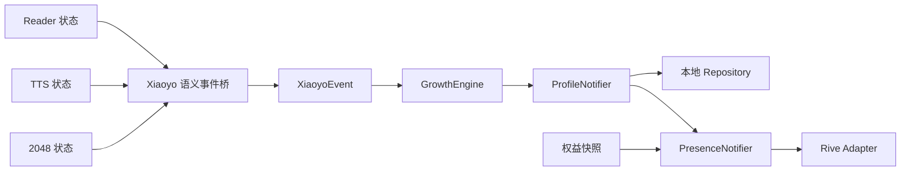
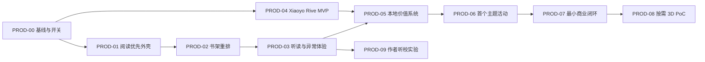

# 20260713 阅游产品、Xiaoyo 与性能改进总详设

## 0. 文档定位与阅读导航

### 0.1 文档状态

- 文档日期：2026-07-13。
- 产品方向：阅读优先，Xiaoyo 为长期关系与品牌资产，2048 为可选陪伴模式。
- 目标终端：Android 手机竖屏，首要验收视口为 390 x 844。
- 当前交付：可直接拆分开发、测试和商业验证的详细设计，不代表功能已实现。
- 当日文件规则：沿用今天唯一任务文件，合并性能、产品、IP 与商业内容，
  不再创建第二份 `DevelopmentPlan/20260713_*.md`。

### 0.2 状态口径

本文统一使用三种口径，评审、排期和领导汇报不得混用：

| 口径 | 定义 | 使用要求 |
| --- | --- | --- |
| 当前事实 | 已从当前源码、构建产物或仓库文档核实 | 可作为现状依据 |
| 建议目标 | 推荐建设的功能、架构和验收门槛 | 实施后必须验证 |
| 商业假设 | 关于付费、留存、IP 和价格的判断 | 只能由真实行为与真实支付证明 |

### 0.3 阅读顺序

- 领导决策：先读第 10、15、20、21 和 23 节。
- 产品与设计：先读第 11 至 17 节。
- 研发与测试：先读第 18 至 22 节，再结合第 1 至 9 节的性能基线。
- 第 1 至 9 节保留已完成的性能报告与后续可执行性能详设，不重复改写。

## 1. 已完成性能子任务目标

基于当前源码与既有性能治理记录，形成一份可离线打开的单文件 HTML，统一承载：

- 面向管理者的改进摘要与决策信息。
- 面向产品与研发的交互式改造原型。
- 面向实施人员的性能架构详细设计。
- 分阶段实施路线、风险、验收指标与回滚边界。

本任务仅产出设计和汇报材料，不修改 Flutter、Dart、Go 业务代码，也不把建议目标描述成已实测结果。

## 2. 已确认的性能交付设计

- [x] 交付载体采用离线 HTML，不依赖网络资源。
- [x] 使用单文件多视图结构，包含“领导摘要、改进原型、详细设计、实施路线”四个页签。
- [x] 视觉沿用阅游品牌，但降低霓虹密度，优先保证管理阅读、技术扫描和打印可读性。
- [x] 原型覆盖冷启动、2048 渲染、提词器、大书导入、TTS 会话五条关键链路。
- [x] 目标指标统一标注为“建议门槛”或“待 Profile 验证”，不得写成当前实测收益。

## 3. 性能源码证据基线

本次设计以以下已核实事实为基础：

- 启动阶段存在音频服务前置初始化，环境音会生成 30 秒 PCM 数据，自动性能档位仍依赖同步 CPU 微基准。
- 2048 棋子使用 `AnimatedPositioned`，高频滑动会进入布局阶段。
- 提词器同一进度流同时驱动滚动位置和富文本重建。
- Dashboard、Settings、Reader 等界面存在整对象监听，局部状态变化会扩大重建范围。
- TXT 导入虽使用 Isolate 解析，但完整行列表仍回传主 Isolate，并整体 JSON 编解码和常驻内存。
- TTS 双轨泵缺少独立代际令牌，Reader 切章缺少 latest-wins 请求提交约束。
- 2026-05-12 性能计划中的真机 GPU、连续滑动与长会话验收仍未闭环。

## 4. 性能子任务设计边界

### 4.1 本次包含

- 性能目标架构与模块职责。
- 当前链路与目标链路的可视化对比。
- 状态、异步、缓存、渲染和持久化设计。
- 验收场景、指标口径、实施拆分、风险与回滚策略。

### 4.2 本次不包含

- 业务代码重构。
- 真机 Profile 数据采集。
- 工期承诺或未经基线验证的收益承诺。
- 新功能、AI 能力或视觉风格重做。

## 5. 性能子任务执行清单

- [x] 完成单文件 HTML 主交付。
- [x] 完成桌面视口截图与交互检查。
- [x] 完成手机视口截图与排版检查。
- [x] 检查控制台错误、外部网络依赖和打印样式。
- [x] 执行 Markdown、HTML、Git diff 基础门禁。
- [x] 更新 `development_log.md` 并评估 README。
- [x] 使用中文 Conventional Commit 提交本次 7 个文件。
- [ ] 普通推送当前分支：远端包含本地没有的历史，非快进被拒绝；禁止强推。

## 6. 性能子任务验收标准

- HTML 可直接从本地文件打开，四个页签与场景切换正常。
- 1440 x 1000 和 390 x 844 视口无横向溢出、文字遮挡或不可操作控件。
- 页面不请求外部字体、脚本、图片或接口。
- 领导摘要不依赖源码知识即可理解“为什么改、改什么、投入多少、如何验收、需要什么决策”。
- 详细设计覆盖架构、组件、数据流、异常处理、测试、迁移和回滚。
- 所有性能数值明确区分“当前事实”“建议门槛”“待验证目标”。

## 7. 性能子任务风险与约束

- 当前工作树存在版权材料与 `server_py/` 等用户既有改动，本任务不得修改、暂存或回滚这些内容。
- 现有 `yueyou_test` 与远端历史明显分叉，推送前必须确认普通推送是否可行，禁止强推。
- README 仅在用户可见能力、启动方式或架构事实实际变化时更新；本次预计无需修改。

## 8. 性能子任务验证结果

### 8.1 交付内容

- 主交付：`docs/performance/20260713_阅游性能架构改进方案.html`。
- 页面包含 4 个报告视图、5 条交互式性能链路、9 个详细设计模块和
  6 个性能实施包。
- 性能实施包使用 `PERF-0` 至 `PERF-5`，避免与 2026-07-11 治理计划的
  `PR-1` 至 `PR-10` 冲突，并标明治理依赖。
- 人日估算按分项求和统一为 17-24 人日；首批只申请 PERF-0 的
  1-2 人日，其余 16-22 人日由真机基线评审后分段批准。

### 8.2 内容复核

- 领导口径明确区分源码风险、建议门槛、待验证目标和当前实测结果。
- Flutter 帧预算分别统计 `buildDuration` 与 `rasterDuration`，不把两个
  流水阶段简单相加为“总帧耗时”。
- 大书设计将语义章节与有界物理 chunk 分离，覆盖无章节 15MB TXT；
  首个稳定版本使用双读与 legacy shadow write 支持旧 APK 回滚。
- Reader generation、TTS semantic session、runnerEpoch 与 HTTP operationId
  各自归属独立 owner，通过 `contentRevision` 连接，不共享计数器。
- TTS 保持 POST 获取 JSON URL、GET 下载音频的两步契约；正文和进度
  继续纯本地存储。

### 8.3 浏览器验收

- 使用本机 Chrome 和 Playwright 在 1440 x 1000、390 x 844 两个视口验证。
- 4 个页签、5 个场景、方向键、Home/End 与 roving tabindex 均通过。
- 两个视口的页面级横向溢出均为 0；控制台错误、页面异常和外部请求均为 0。
- 打印模式包含全部 5 个场景和 9 个展开的详细设计模块，打印后可恢复
  原展开状态；打印强调色已切换为白底高对比版本。
- 截图保存于 `docs/performance/screenshots/`，包含桌面与手机的领导摘要、
  改进原型共 4 张。

### 8.4 文档评估

- 本次没有修改应用功能、启动方式、依赖或既有架构事实，README 无需更新。
- `markdownlint-cli` 检查今日任务单与 `development_log.md`，结果零告警。
- HTML 静态扫描无 TODO、FIXME、外部 URL、外部脚本、网络接口或遗留高风险
  口径；浏览器加载时控制台与页面异常均为 0。
- `flutter analyze` 通过：`No issues found!`。
- `flutter test --concurrency=1` 通过：672 passed、4 skipped、0 failed。
- `dart scripts/ai_code_checker.dart` 通过：0 blocking、22 条既有 warning。
- `server/` 下 `go vet ./...` 与 `go build ./...` 通过。
- 暂存区仅包含本任务 7 个文件，`git diff --cached --check` 通过。

### 8.5 Git 收口

- 使用 `docs(performance): 完善性能架构改进原型与报告` 创建本地提交。
- `git push origin yueyou_test` 被远端以 `fetch first` 拒绝；本地分支与远端
  已明显分叉，且工作树存在用户既有未提交材料，因此未执行 pull、rebase 或强推。
- 版权材料、`.codex/`、`.superpowers/` 与 `server_py/` 等既有改动未被暂存、
  修改或回滚。

## 9. 可执行性能详设增补

### 9.1 增补目标

在既有性能架构改进报告之外，新增一份可直接指导开发的独立离线 HTML，
把 `PERF-0` 至 `PERF-5` 细化到：

- 进入条件、退出条件和治理依赖。
- 新增、修改、迁移和禁止扩责的真实文件清单。
- Dart 接口草案、状态机、数据格式和所有权边界。
- 自动化测试、真机 Profile、故障注入和回滚开关。
- 可独立审查、验证和回滚的小提交切片。

### 9.2 关键设计决策

- 实施顺序采用
  `PERF-3-A → PERF-2-A/B/C → PERF-3-B/C → PERF-4 → PERF-5`，
  不按编号机械执行。
- 2048 使用纯 Dart `GameEngine`，棋盘使用 `Transform` 驱动位移动画；
  GameEngine 不进入 Isolate。
- 提词器采用 Ticker 进度控制器、`CustomPainter` 和单帧滚动提交，
  进度变化只触发 paint，不重建整棵富文本 Widget。
- TTS HTTP 使用真实取消和连接复用，双轨 runner 改为事件唤醒；
  Reader 使用 latest-wins generation。
- 本地大书使用 256KB 或 1000 单元的有界 chunk；首个稳定版本只对
  新导入书执行 v2 + legacy shadow，旧书批量迁移延后单独立项。
- Reader generation、TTS semantic session、runnerEpoch、HTTP operationId
  和书籍 contentRevision 各自保持明确 owner，不共享计数器。

### 9.3 交付与验收清单

- [x] 新增 `docs/performance/20260713_阅游性能架构可执行详设.html`。
- [x] 补齐源码热点证据、六个性能包和跨包契约。
- [x] 完成 1440 x 1000 桌面视口验收与截图。
- [x] 完成 390 x 844 手机视口验收与截图。
- [x] 验证搜索、导航、详情展开、本地清单持久化与打印恢复。
- [x] 检查页面横向溢出、控制台错误、页面异常和外部请求。
- [x] 执行 Markdown、HTML、Flutter、AI 与 Go 门禁。
- [x] 更新 `development_log.md` 并评估 README。
- [x] 只提交本次详设相关文件，创建中文 Conventional Commit。
- [ ] 普通推送被远端以 `fetch first` 拒绝；分支已分叉，禁止强推。

### 9.4 增补验收结果

- 独立详设 HTML 大小为 108,325 字节，包含 19 个可展开详细设计块、
  26 项本地执行清单、6 个性能实施包和完整跨包契约。
- 使用系统 Chrome DevTools 协议复验 1440 x 1000 与 390 x 844 视口；
  本机未提供可运行的 `playwright-cli`，因此未下载新工具，也未向 C 盘写入
  浏览器自动化缓存。
- 两个视口页面级横向溢出均为 0；按钮文字无溢出；移动端锚点在粘性导航
  下方 180px 正确停稳。
- 搜索、19 个详情块全展开/收起、打印前展开与打印后状态恢复、26 项清单
  `localStorage` 持久化均通过。
- 浏览器外部请求、控制台错误与页面异常均为 0；HTML 静态扫描无外部引用、
  TODO、FIXME 或重复 ID。
- 最终截图为 `docs/performance/screenshots/可执行详设_桌面.png` 与
  `docs/performance/screenshots/可执行详设_手机.png`。
- `flutter analyze --no-pub` 通过：`No issues found!`。
- `flutter test --no-pub --concurrency=1` 通过：672 passed、4 skipped、
  0 failed。
- `dart scripts/ai_code_checker.dart` 通过：0 blocking、22 条既有 warning；
  本任务未增加业务代码 warning。
- `server/` 下使用 D 盘 Go 缓存执行 `go vet ./...` 与 `go build ./...` 通过。
- README 无需更新：本轮未改变应用功能、启动方式、依赖或已实现架构。

### 9.5 Git 收口

- 本地提交只包含可执行详设 HTML、两张最终截图、本节任务单增补和开发日志，
  共 5 个文件。
- 今日任务单中并行出现的产品、Xiaoyo 与商业设计内容未纳入本任务暂存区；
  版权材料、`docs/product/`、`.codex/`、`.superpowers/` 与 `server_py/` 等
  用户既有改动也未被暂存、修改或回滚。
- `git push origin yueyou_test` 被远端以 `fetch first` 拒绝；未执行 pull、
  rebase 或强推。

## 10. 领导决策摘要

### 10.1 建议批准的方向

阅游不再以“2048 游戏加听书”为主叙事，统一定位为：

> **以本地长文本听读为核心、由 Xiaoyo 提供长期陪伴与收藏价值的私人听读伴侣。**

产品价值优先级固定为：

1. 随时可靠地继续一本长书。
2. 在阅读、听读和后台场景中保持连续进度。
3. 用 Xiaoyo、书境印记和荣誉形成长期关系。
4. 用 Local Pro 与书境资产放大效率和情感价值。
5. 2048 作为听读时的可选陪伴行为，不再定义首页。

### 10.2 本次申请的授权

建议领导批准一个四周、外部现金封顶、到期必须复盘的阶段 0，而不是一次批准
全面商业化或 41-63 人日的正式产品改版：

| 轨道 | 四周内必须交付 | 四周内明确不做 |
| --- | --- | --- |
| 产品验证 | 可点击手机 HTML、24 次访谈、40 次有效体验、演示记录 | Flutter 全面改版、付费买量 |
| Xiaoyo | 人工四视图要求、原创近似检查、基础 Rive 动作样片 | 完整九动作量产、Unity、3D 世界 |
| 价值验证 | 成长、一个印记、一个荣誉和免费/付费书境的原型规则 | 正式账号、远程活动、会员系统 |
| 商业验证 | Local Pro 订金、书境全款和作者听校的真实支付实验 | 普通用户默认年费、无限云 TTS |
| 工程基线 | `PERF-0` 真机基线、`PROD-00` 功能开关与回滚验证 | `PROD-01` 至 `PROD-09` 正式实现 |

阶段 0 计划投入 34 人日，可由多人并行：产品与用户研究 15 人日、Flutter
基线与技术核对 5 人日、角色与 Rive 样片 8 人日、测试和实验运营 6 人日。
建议角色配置为 1 名产品/交互负责人、1 名 Flutter 开发、1 名兼职角色与
Rive 动效设计、1 名兼职测试。若只能由 1 人串行承担，则必须延长周期或删除
对应交付，不得仍承诺四周完成。

阶段 0 外部现金支出上限建议为 **20,000 元**，不含现有员工工资：

| 支出 | 上限 | 使用边界 |
| --- | ---: | --- |
| 访谈、有效体验和作者测试激励 | 6,000 元 | 完成有效任务后发放，不购买虚假流量 |
| Xiaoyo 四视图、原创近似检查和 Rive 样片 | 8,000 元 | 分里程碑验收，不预付完整量产费用 |
| 合规商户收款页、退款和实验工具 | 2,000 元 | 不使用个人收款码，不建设正式商城 |
| 设备借测、交通和素材核验 | 1,500 元 | 不采购 Unity 或 3D 资产 |
| 预备金 | 2,500 元 | 仅由项目负责人书面确认后使用 |

招募优先使用现有用户、阅读/TTS 社群、作者社群、垂直内容和定向研究招募；
研究激励不等于产品付费买量。阶段 0 不列支 AI 调用、云音色采购、Unity 授权、
3D 量产和版权内容采购。

### 10.3 批准后的决策门

- 达到真实付费、七日回访和 Xiaoyo 价值指标后，批准最小商业闭环。
- 只验证出工具价值时，Xiaoyo 保留为免费品牌资产，停止批量生产皮肤。
- 只验证出作者听校价值时，转向创作者工具，不用普通读者假设支撑投入。
- 留存未通过时，优先修听读稳定性，不建设会员系统、不做付费买量。
- Rive 付费视觉资产未通过前，不批准正式 3D 资产和 Unity 接入。

## 11. 当前事实与产品诊断

### 11.1 已核实事实

| 编号 | 当前事实 | 产品影响 |
| --- | --- | --- |
| F-01 | `DashboardScreen` 以 2048 棋盘为视觉中心，顶部打开书架、目录和设置 | 新用户难以第一眼识别听读主任务 |
| F-02 | 已有 TXT 导入、编码识别、章节导航、进度恢复、云端 TTS、本地降级和跨章续播 | 不应重写已有播放器内核，应先重排信息架构并修稳定性 |
| F-03 | 书架支持导入、进度、删除和默认《西游记》 | 可直接改造成阅读入口和样书体验 |
| F-04 | 当前 Xiaoyo 是 `68 x 84` Canvas 吉祥物，主要响应 2048 和 TTS 错误 | 角色尚未进入听读主线，也没有持久关系数据 |
| F-05 | `assets/rive/xiaoyo.riv` 来自 Rive Community，状态机契约未完成 | 不能作为商业 IP 主资产，必须建立原创文件和授权链 |
| F-06 | 当前没有账号、支付、权益、荣誉、活动或成长系统 | 任何收入和留存结论都属于待验证假设 |
| F-07 | 阅读正文、进度和设置按项目约束纯本地保存 | 商业化不能依赖上传书籍正文或阅读明细 |
| F-08 | 当前 arm64 Release APK 为 25,852,724 字节，项目目标约 28MB | Unity 双引擎几乎必然突破现有轻量包目标 |
| F-09 | Go TTS 使用单并发 `edge-tts`，缺少鉴权、配额和限流，并记录原始请求文本 | 当前云 TTS 不能直接包装为收费服务 |
| F-10 | OSS URL 按公开前缀返回，缓存生命周期与隐私边界尚未产品化 | 云音色商业化前必须完成供应商、隐私和单位成本验证 |

### 11.2 核心问题

1. **产品识别错位**：首页强化游戏和赛博视觉，弱化“继续听完一本书”。
2. **免费替代充分**：本地导入、系统朗读和基础进度已是常见免费能力。
3. **IP 尚未资产化**：Xiaoyo 有即时反应，没有统一形象、关系、荣誉和世界观。
4. **付费理由不够硬**：仅靠无广告、隐私和基础 TTS 难以形成稳定付费。
5. **云端不可直接售卖**：当前 TTS 的授权、隐私、成本和服务治理没有闭环。
6. **性能债影响主线**：启动、提词器、大书、TTS 会话和 2048 渲染风险尚需按
   第 1 至 9 节继续治理。

## 12. 用户、任务与产品原则

### 12.1 目标用户

| 优先级 | 用户 | 典型场景 | 主要问题 |
| --- | --- | --- | --- |
| P0 | 本地长文听读用户 | 通勤、家务、散步、睡前听 TXT 小说或长文 | 导入麻烦、误读、进度丢失、后台中断 |
| P1 | 陪伴型长期用户 | 每周多次听读，希望形成长期累计和可见成长 | 普通播放器没有关系资产和完本仪式 |
| P2 | 独立作者、网文作者 | 用朗读发现错字、断句、重复和专名发音问题 | 人工通读耗时，现有听书工具回找困难 |
| 非目标 | 寻找版权书城、免费网文信息流、冲榜或奖励用户 | 依赖内容供给、广告和强刺激运营 | 与本地私密听读定位冲突 |

P2 作者听校是独立商业实验，不进入普通用户首屏，也不与普通读者收入混算。

### 12.2 核心任务

| 编号 | 用户任务 | 完成标准 |
| --- | --- | --- |
| JTBD-01 | 导入或选择一本书 | 新用户最多 3 次有效点击开始播放样书或本地 TXT |
| JTBD-02 | 继续上次听读 | 返回 App 后一次点击恢复到上次书、章和句段 |
| JTBD-03 | 控制听读 | 可播放、暂停、切句、切章、调速、换音色和定时停止 |
| JTBD-04 | 从异常恢复 | 云端失败后可重试或使用本地音色，不进入无出口状态 |
| JTBD-05 | 管理书籍 | 可导入、搜索、排序、查看进度、继续和删除 |
| JTBD-06 | 与 Xiaoyo 建立关系 | 有效听读、章节和完本形成可恢复的成长与荣誉 |
| JTBD-07 | 参与主题活动 | 不签到、不冲榜，也能用真实听读完成目标 |
| JTBD-08 | 判断是否值得付费 | 先看到或听到免费与付费差异，再用人民币直接购买 |

### 12.3 产品原则

- 阅读优先：当前书、继续听读和正文永远高于游戏、活动和付费入口。
- 免费完整：免费用户能导入、听读、恢复、成长、获得荣誉和导出数据。
- 付费放大：付费购买效率、沉浸舞台和收藏表达，不购买基本可靠性。
- 本地优先：正文、标题、目录、进度、设置和关系明细默认不上传。
- 安静陪伴：Xiaoyo 用动作表达，不频繁说话、不遮挡正文、不制造焦虑。
- 荣誉可信：荣誉靠行为获得，不出售、不加速、不掉级、不做排行榜。
- 小步验证：所有价格、转化、留存和 3D 价值都先验证再建设。

## 13. 阅读优先信息架构

### 13.1 根导航

```text
阅游
├─ 听读
│  ├─ 当前书与继续听读
│  ├─ 正文阅读
│  ├─ 章节目录
│  └─ 完整播放器
├─ 书架
│  ├─ 全部书籍
│  ├─ 导入与导入状态
│  ├─ 搜索、排序和筛选
│  └─ 书籍详情与章节
├─ 陪伴
│  ├─ Xiaoyo
│  ├─ 书境印记
│  ├─ 荣誉册
│  ├─ 主题活动
│  └─ 一起玩 2048
└─ 二级入口
   ├─ 设置
   ├─ 音色与缓存
   ├─ 数据导出与恢复
   └─ 已购权益
```

导航规则：

- 根导航固定为 `听读 / 书架 / 陪伴`。
- 章节属于当前书，不再占用根导航。
- 设置放在右上角二级入口。
- Mini Player 跨三个根页面持续存在。
- 切换根页面不得重建 TTS 会话或中断音频。
- 2048 只能从“陪伴”进入，游戏时听读继续。

### 13.2 听读首屏

| 状态 | 首屏内容 | 主动作 |
| --- | --- | --- |
| 无当前书 | 导入说明、样书入口、基础 Xiaoyo | 导入本地书 |
| 有当前书未播放 | 书名、章节、进度、上次位置、正文摘要 | 继续听读 |
| 播放中 | 当前句段、章节、播放进度、Xiaoyo 低干扰状态 | 暂停或进入全文 |
| 缓冲中 | 保留当前句，显示可取消缓冲和本地音色出口 | 继续等待或本地继续 |
| 错误 | 简明原因、重试、本地音色、诊断入口 | 本地音色继续 |
| 完本 | 免费荣誉、共读回顾、Xiaoyo 完本动作 | 保存回顾或选下一本 |

首屏禁止启动广告、强制登录、首次打开付费弹窗和活动弹窗。

### 13.3 可点击手机产品原型

产品原型固定交付为：
`docs/product/20260713_阅游产品改进手机原型.html`。文件使用本地 HTML、CSS
和 JavaScript，可离线直接打开；首要视口为 390 x 844，桌面打开时提供演示
控制台，但手机区域仍按真实竖屏布局和触控尺寸验收。

| 演示场景 | 必须可点击完成的路径 | 领导观察点 |
| --- | --- | --- |
| 首次进入 | 样书 -> 播放 -> 正文 | 不登录、不弹付费墙，2 次主点击开始 |
| 继续听读 | 当前书 -> 播放/暂停 -> 全文 | 当前任务和状态一眼可见 |
| 书架 | 搜索 -> 选择书 -> 快速继续 | 书架成为根页面，不再藏在 Modal |
| 异常恢复 | 模拟云音色失败 -> 切本地音色 -> 继续 | 错误有出口，Xiaoyo 不抢主动作 |
| 关系与荣誉 | 陪伴 -> 印记 -> 活动 -> 解锁荣誉 | 累计不掉级、不签到、不出售荣誉 |
| 付费对比 | 同一荣誉切换免费/付费书境 -> 预购确认 | 差异足够可见，但所得荣誉完全相同 |
| 完本 | 触发完本 -> Xiaoyo 纪念动作 -> 下一本 | 形成可积累的私人关系与继续路径 |

建议演示顺序固定为：首次进入、继续听读、异常恢复、书架、关系成长、免费/
付费对比、完本。原型中的音频、进度、Rive 和支付均为本地模拟，不得把按钮
反馈解释成真实服务已实现；其作用是验证信息架构、价值表达和用户选择。

### 13.4 原型验收记录

- 原型文件为 `docs/product/20260713_阅游产品改进手机原型.html`，不引用外部
  字体、脚本、图片或网络接口；Xiaoyo 候选图仅使用本地相对路径。
- 已在 1440 x 1000 桌面工作台和 390 x 844 手机竖屏执行点击验收：首次进入、
  样书播放、异常恢复、书架搜索与快速继续、全文、活动、荣誉、书境对比和完本
  均可完成。
- 手机视口检查结果：文档和活动页面横向溢出均为 0，按钮文字无截断，Mini Player
  不与底部导航重叠，5 个 Xiaoyo 图片实例均成功加载。
- 最终截图保存为
  `docs/product/screenshots/20260713_阅游产品原型_桌面.png` 和
  `docs/product/screenshots/20260713_阅游产品原型_手机.png`。

## 14. 端到端用户流程

### 14.1 首次启动与导入

1. 启动后先完成隐私前置，不提前初始化网络请求。
2. 无当前书时显示“导入本地书”和“先听《西游记》”。
3. 文件选择后显示选择、解析、成功、失败和取消状态。
4. 解析成功后展示书名、识别章节数和“开始听读”。
5. 首次播放前不要求注册，也不显示付费墙。
6. 导入失败时保留原文件，不生成半成品书架记录。

验收要求：从首屏到样书播放不超过 2 次有效点击；从首屏到本地书播放不超过
3 次有效点击，不把系统文件选择器内部操作计入产品点击数。

### 14.2 继续听读

1. 点击“继续听读”。
2. 恢复当前书、章节、句段和正文滚动位置。
3. 正文与当前朗读句同步高亮。
4. 用户可切句、切章、调速、换音色和设置定时停止。
5. 章末自动进入下一章，书末进入完本页。
6. 章节和完本事件写入本地关系记录，并触发 Xiaoyo 克制反馈。
7. 切后台后音频按既有策略继续，Xiaoyo 和非必要渲染暂停。

### 14.3 书架管理

| 需求 | 验收要求 |
| --- | --- |
| LIB-01 列表 | 默认按最近听读排序，显示书名、章节、进度和上次时间 |
| LIB-02 快速继续 | 点击主体继续听读，更多菜单承载详情、重命名和删除 |
| LIB-03 搜索排序 | 支持书名搜索，以及最近阅读、导入时间和进度排序 |
| LIB-04 删除 | 正在播放的书先停止；正文、进度和印记分别确认处理 |
| LIB-05 空状态 | 只保留“导入本地书”和“添加样书”两个动作 |

书架不出现书城、推荐信息流、畅销榜和版权内容购买入口。

### 14.4 陪伴与活动

陪伴页采用 `Xiaoyo / 印记 / 活动` 三段视图：

- `Xiaoyo`：当前形态、关系阶段、最近共读记忆和一个可执行动作。
- `印记`：按书籍展示开始、阶段完成、完本和活动纪念。
- `活动`：展示当前主题、累计条件、已获荣誉和可预览书境。
- `一起玩 2048`：次级入口，不改变听读主会话。

首个活动闭环固定为：

```text
选择用户自带书籍
  -> 累计有效听读
  -> 完成阶段目标
  -> Xiaoyo 触发纪念动作
  -> 获得永久书境印记
  -> 在免费或付费书境中陈列
```

### 14.5 付费预览与购买

1. 用户主动进入 Pro 对比、主题页或完本庆典预览。
2. 用同一段文本展示清理、发音和分书预设差异。
3. 用同一个荣誉展示免费书境与付费书境的完整舞台差异。
4. 明确标注一次性买断、单包购买或按量服务，不使用模糊“会员价”。
5. 购买后即时交付权益，并提供恢复购买和退款规则入口。
6. 启动、播放中途和错误恢复期间禁止弹出付费提示。

## 15. 免费、付费与商业设计

### 15.1 免费与付费边界

原则是：**免费完成任务，付费放大体验；荣誉靠行为获得，不能靠钱购买。**

| 能力 | 免费版 | 付费版 | 口径 |
| --- | --- | --- | --- |
| TXT 导入、书架、章节和进度恢复 | 完整可用 | 不重复收费 | 建议目标 |
| 系统本地 TTS、基础控制和后台播放 | 完整可用 | 不重复收费 | 建议目标 |
| 长会话不中断和异常可恢复 | 完整可用 | 不重复收费 | 建议目标 |
| 基础文本清理和章节识别 | 完整可用 | 高级规则与批量修复 | 建议目标 |
| 作品级发音词典和分书朗读预设 | 可试用 | Local Pro 完整使用 | 商业假设 |
| Xiaoyo 默认形象、基础动作和成长 | 完整可用 | 不加速成长 | 建议目标 |
| 基础书境印记、荣誉和活动 | 完整参与 | 荣誉不能购买 | 建议目标 |
| 主题材质、空间、音景、转场和专属动作 | 可预览 | 单独书境包或典藏权益 | 商业假设 |
| 云端高品质音色 | 仅试听预生成公共样文，不上传用户正文 | 合规后按时长或字数计量 | 商业假设 |
| 数据导出和本人换机恢复 | 完整可用 | 不收费 | 建议目标 |
| 作者听校 | 不进入普通版主流程 | 独立商品实验 | 商业假设 |

付费差异必须在第一次进入、持续听读、章节完成、荣誉获得和完本五个节点
可被看见，但免费版的可靠性、基本人格和用户挣得的荣誉不能故意做差。

### 15.2 商品结构

| 商品 | 建议形态 | 首轮价格假设 | 核心价值 | 建设条件 |
| --- | --- | ---: | --- | --- |
| 免费版 | 长期免费 | 0 元 | 完整本地听读、基础 Xiaoyo、成长和活动 | 产品基座 |
| Local Pro | 当前大版本一次性买断 | 49 / 79 / 119 元随机测试 | 高级清理、发音词典、分书预设和高级本地控制 | 真实付款通过 |
| 书境包 | 单包人民币购买 | 9.9-18 元首测 | 角色材质、空间、音景、转场、章节和完本演出 | IP 独立支付通过 |
| 云音色 | 按时长或字数充值 | 按持牌供应商成本计算 | 更自然的声音；免费页只播公共样文 | 授权、隐私和单位经济通过 |
| 作者听校 | 年费或按作品 | 49 元/年创始价首测 | 问题标记、原句定位、发音词典和报告 | 独立作者实验通过 |

正式云音色售价下限按以下模型计算：

```text
售价 >= 单位供应成本 / (1 - 支付渠道费率 - 目标毛利率)
```

目标毛利率 60% 仅作为内部验证门槛。当前 `edge-tts` 方案缺少商业授权、鉴权、
配额、限流、脱敏日志和私有缓存治理，不能直接收费，也不能进入价格实验。

手动导出、手动导入、本人换机恢复和同商店账号恢复已购权益属于免费基础能力，
不得再次包装进 Local Pro。Local Pro 只控制高级本地效率功能；书境包只控制
视觉、音景和动作资产；云音色只控制已计量的持牌语音服务，三类权益互不包含。

### 15.3 付费前后效果验收

付费差异不只写在权益表里，必须用同一输入和同一荣誉做可复现对照：

| 对照样例 | 免费体验 | 付费体验 | 通过门槛 |
| --- | --- | --- | --- |
| 60 段含噪长文 | 基础非破坏清理，可逐段确认 | 自定义规则、批量预览、撤销和分书复用 | 人工修正次数下降至少 50%，误删正文为 0 |
| 20 个专名与多音字 | 每本可试 3 条临时读音 | 作品级词典、批量导入和分书预设 | 人工设置后至少 18/20 正确朗读 |
| 同一个“第一本共读”荣誉 | 基础台座、默认 Xiaoyo 动作 | 完整主题空间、音景、材质和专属演出 | 至少 80% 有效体验者无需解释能指出差异 |
| 同一公共样文音色 | 本地系统音色和预生成云音色试听 | 合规云音色按量播放用户文本 | 不上传正文试听；正式付费仍受成本门约束 |

原型必须同时保留“继续听读”和“查看付费效果”，不能让购买按钮成为唯一主动作。
40 名有效体验者均需完成至少一组免费/付费盲序对照；只有全款、退款和放弃原因
进入第 21 节决策表，单纯选择“更好看”不计为付费成立。

### 15.4 付费触发规则

- 不设置首次启动付费墙。
- 用户未成功听读前不展示 Pro 购买页。
- 异常、缓冲和恢复流程不出现营销内容。
- 用户主动预览、完成章节、获得荣誉或完本后，才可展示一次克制入口。
- 同一场景七天内不重复打断；频次由配置控制，不在 Widget 中硬编码。
- 付费购买不得增加成长点、替代活动进度或直接发放荣誉。
- 所有数字资产使用人民币明码标价，不引入金币、钻石或充值币。

### 15.5 明确不做项

- 不建设版权书城，不采购或分发无授权正文。
- 不做广告信息流、开屏广告和奖励广告。
- 不做排行榜、金币、签到、连续打卡、体力和断签惩罚。
- 不做抽卡、概率盲盒、付费加速成长和直接购买荣誉。
- 第一阶段不做 AI 角色聊天、续写、摘要和推荐信息流。
- 不靠低价无限云 TTS 获客。
- 不上传用户书籍正文、具体阅读进度和设置。
- 不强制登录，不用书籍和进度制造迁移壁垒。
- 不在日常听读页常驻高功耗 3D 场景。
- 不在留存与真实付款未验证前进行付费买量。
- 第一阶段只保证 Android 手机竖屏主体验，不同步扩张桌面、Web 和社交生态。

### 15.6 AI 边界

第一阶段不需要 AI。文本清理、章节识别、成长规则、荣誉判定和 Xiaoyo 动作
均使用确定性本地逻辑，保证成本、口吻和隐私可控。

后续 AI 候选能力按优先级为：

1. 作者听校的问题建议和跨章专名一致性。
2. 发音词典候选与确定性人工确认。
3. 带章节引用的上下文问答小实验。

任何 AI 能力必须单独通过正文授权、引用准确率、单位成本和关闭开关验收；
AI 角色聊天、续写和摘要不能以“完善 Xiaoyo 人格”为理由绕过决策门。

## 16. Xiaoyo 2.0 角色与动态详设

### 16.1 概念图状态


该图片定义为 **“Xiaoyo 2.0 候选母版 M-02”**，仅用于方向和研发沟通：

- 不是最终 IP 定稿。
- 不能直接进入 Rive 绑定、3D 量产或版权登记。
- 不得对外宣称已完成独创性或商标近似审查。
- 最终资产必须由人工完成四视图、结构、表情、动作和设计过程留档。

已确认的视觉方向：

- 高级潮玩公仔气质，约 2.2 头身。
- 暖纸白圆润身体，石墨黑不对称折页和右侧声学鳍片。
- 胸口透明书声核心，单条书签尾和暖金尾端。
- 小椭圆眼和克制微笑，折页内侧保留小面积珊瑚标记。
- 不明确属于猫、狗、兔，也不表现为机器人或宇航员。

人工定稿必须解决：

- 正、侧、背、顶四视图的一致结构。
- 折页厚度、内外层、连接方式和可活动范围。
- 右侧鳍片数量、背面连接和纯黑剪影识别。
- 尾根、手脚关节、声核嵌入和专属书声符号。
- 32px、48px、68px、120px 的识别与裁切测试。
- 名称、商标、角色轮廓和现有 IP 的近似检索。

### 16.2 世界观与性格

文字在被持续聆听时形成短暂“书境”，Xiaoyo 是守护书页与声音连接的守页灵。
它不读取或理解正文，只依据本地发生的有效听读、章节、完本和活动事件成长。

| 性格 | 行为要求 |
| --- | --- |
| 安静 | 不频繁打断阅读，不主动制造焦虑 |
| 好奇 | 用眼神、折页、尾巴和声核回应操作 |
| 可靠 | 错误时克制，恢复后自然回到陪伴状态 |
| 有分寸 | 不假装理解正文，不说虚假共情话术 |
| 稍显笨拙 | 动作带轻微迟滞和回弹，但不幼儿化 |

禁止催促签到、责备中断、卖惨索取关注、自称 AI 或老师，以及用购买行为换关系等级。

### 16.3 视觉 DNA 与尺寸

付费皮肤不得同时改变以下五个识别点中的三个以上：

1. 左大右小的不对称头部轮廓。
2. 暖纸白、短肢、约 2.2 头身的潮玩比例。
3. 胸口书声核心。
4. 单条石墨黑书签尾和暖金尾端。
5. 折页内侧的珊瑚书签标记。

| 场景 | 建议容器 | 渲染方式 | 内容约束 |
| --- | ---: | --- | --- |
| 通知头像 | 32 x 32 | 静态预渲染 | 只保留轮廓和眼睛 |
| Mini Player | 48 x 60 | 简化 Rive | 隐藏声核内部细节 |
| 2048 兼容位 | 68 x 84 | 标准 Rive | 不抢棋盘手势 |
| 听读首页 | 96 x 120 | 标准 Rive | 不遮挡正文与主动作 |
| 陪伴与荣誉页 | 最大 180 x 216 | 完整 Rive | 展示材质和专属动作 |
| Rive 母画板 | 600 x 720 | 制作基线 | 四周保留 10% 安全区 |

可点击区域不得小于 48 x 48。系统开启“减少动态效果”后，仅保留眨眼、
声核明暗和 150ms 内的确认反馈。

### 16.4 Rive 状态机契约

首版技术路线固定为 Rive 2.5D。统一状态机名为 `XiaoyoStateMachine`，
免费和付费 `.riv` 文件必须实现相同输入契约。

| 输入 | 类型 | 范围或含义 |
| --- | --- | --- |
| `audioState` | Number | 0 空闲、1 缓冲、2 播放、3 暂停、4 错误 |
| `contextMode` | Number | 0 听读、1 书架、2 陪伴、3 书境 |
| `lookX` / `lookY` | Number | -1.0 至 1.0 |
| `growthStage` | Number | 0 至 4 |
| `energy` | Number | 0.0 至 1.0，仅控制视觉强度 |
| `reduceMotion` | Bool | 系统减少动态效果 |
| `tap` | Trigger | 点击角色 |
| `chapterComplete` | Trigger | 章节完成 |
| `bookComplete` | Trigger | 完本 |
| `honorUnlocked` | Trigger | 荣誉解锁 |
| `activityReward` | Trigger | 活动里程碑 |
| `returnAfterBreak` | Trigger | 较长中断后返回 |
| `highTileMerged` | Trigger | 2048 可选反馈 |

动画优先级：

```text
完本 / 荣誉
> 活动里程碑
> 点击反馈
> 错误短反馈
> 缓冲 / 播放 / 暂停
> 安静待机
```

免费版至少包含待机呼吸、随机眨眼、播放、缓冲、暂停、点击、章节完成、
完本和错误九类动作。重大动作同一时刻只播放一个；重复触发不排队。
Rive 只消费语义状态，不能成为业务状态权威。

### 16.5 动态与资产路线

| 阶段 | 交付 | 进入条件 |
| --- | --- | --- |
| IP-0 人工定稿 | 四视图、表情表、材质表、动作边界和近似检索记录 | 当前批准即可执行 |
| IP-1 Rive MVP | 原创基础 `.riv`、静态降级图、免费书境和一个付费概念 | IP-0 通过 |
| IP-2 Blender 母资产 | 3D 母模型、商品图和宣传短片资产 | Rive/IP 付费验证通过 |
| IP-3 静态 GLB 样片 | 单角色、单灯光、LOD 和移动端材质验证 | 有明确 3D 付费场景 |
| IP-4 付费 3D 书境 | 换装、旋转查看、成长庆典或空间陈列 | 真机 PoC 与单位经济通过 |

日常听读、书架、Mini Player 和 2048 始终使用 Rive。真 3D 只在书境、
换装、成长仪式和皮肤预览中懒加载。Unity 只有在自由视角房间、物理互动、
AR 或 3D 玩法成为已验证核心付费价值时才单独立项。

### 16.6 原创与资产治理

- 新建原创 `xiaoyo_v2_base.riv`，不修改社区 `xiaoyo.riv` 作为商业母版。
- 所有皮肤实现统一输入契约，并记录资产版本、来源、作者和授权范围。
- 设计源文件、四视图、修改记录和人工决策过程进入受控资产目录。
- 上线前完成名称、图形、轮廓和同类潮玩近似检索，必要时进行专业法律复核。
- 现有版权文档中涉及“原创 Rive Xiaoyo”的口径必须在最终资产完成后另行校正，
  本任务不修改版权材料。

## 17. 关系成长、书境印记、荣誉与活动

### 17.1 价值系统结构

价值系统分为四层，不引入可消费货币：

1. **关系成长**：累计有效听读与首次完成事件，阶段只升不降。
2. **书境印记**：每本书形成一个持续成长、不可购买的私人印记。
3. **永久荣誉**：按确定规则解锁，记录来源和规则版本。
4. **主题活动**：按月或季度开展累计任务，不签到、不冲榜。

用户看到的是“共读成长、同行时光、书境印记和荣誉”，内部字段可使用
`bondXp`，但它不可消费、不可购买、不可转让，也不能成为付费货币。

### 17.2 首版成长规则

以下参数是首版开发默认值，属于建议目标，必须通过真实使用调整：

| 事件 | 增量 | 约束 |
| --- | ---: | --- |
| 有效听读 1 分钟 | 1 | 播放中、游标推进、同一墙钟分钟只计一次 |
| 首次完成一个章节 | 3 | 同一书籍和章节只计一次 |
| 一本书首次达到 95% | 60 | 删除后重新导入不得重复领取 |
| 2048、购买、充值 | 0 | 不影响主成长 |

关系阶段：

| 阶段 | 条件 |
| --- | --- |
| 初遇 | 默认 |
| 相识 | 60 点 |
| 同行 | 600 点且至少完本 1 本 |
| 守页 | 2400 点且至少完本 3 本 |
| 共鸣 | 7200 点且至少完本 10 本 |

有效听读心跳必须满足：TTS 为 `Playing`、游标持续推进、单次补记不超过
90 秒、同一 `eventId` 幂等。系统时间回拨不能撤销阶段或荣誉。

### 17.3 书境印记

每本书只有一个印记，按本地阅读进度升级：

| 进度 | 印记状态 |
| ---: | --- |
| 25% | 微光 |
| 50% | 成形 |
| 75% | 共振 |
| 95% | 封页 |

印记只保存本地书籍 ID、标题快照、进度级别、完成时间、有效听读时长和
视觉种子，不保存正文。删除书籍时必须让用户选择“仅删除正文并保留印记”
或“正文与印记同时删除”，不得静默保留或静默清除。

### 17.4 荣誉

荣誉类别：

- 完本：第一本、五本、十本等。
- 同行时光：十小时、五十小时、一百小时等。
- 关系阶段：同行、守页、共鸣。
- 活动纪念：具体届次的共读季。
- 陪伴模式：2048 单独陈列，不影响听读主成长。

同一 `honorId` 只能解锁一次，必须保存获得时间、来源事件、规则版本和
展示资源 ID。付费可以改变荣誉的陈列空间与演出，不能增加荣誉数量。

### 17.5 首个活动

首测活动为“21 天书境共读季”，只看累计量，不要求连续签到：

| 里程碑 | 免费奖励 | 付费书境附加表现 |
| ---: | --- | --- |
| 60 分钟 | 活动微光印记 | 主题声核材质 |
| 180 分钟 | 活动成形印记 | 主题环境细节 |
| 360 分钟 | 活动共振印记 | 专属待机动作 |
| 600 分钟 | 永久活动荣誉 | 完整书境与完本演出 |

免费用户可以获得全部基础印记和最终永久荣誉。付费用户在相同进度下获得
额外视觉资产，付费不加速里程碑。

### 17.6 关系资产边界

“不可迁移”在本方案中定义为：**不可转让给另一个身份，但本人可以换机恢复，
用户内容可以导出。**

| 数据 | 本地保存 | 用户导出 | 本人恢复 | 转让他人 |
| --- | --- | --- | --- | --- |
| 正文、标题、进度和设置 | 是 | 是 | 是 | 用户自行决定 |
| 成长统计和书境印记 | 是 | JSON/可读摘要 | 是 | 不支持 |
| 荣誉 | 是 | 可读摘要 | 是 | 不支持 |
| 购买权益 | 本地缓存凭证 | 不导出密钥 | 同商店账号恢复 | 不支持 |
| Rive、皮肤和书境资产 | 本地缓存 | 否 | 按权益恢复 | 不支持 |
| 正文语义和句子 | 不上传 | 不进入遥测 | 不上云 | 不适用 |

首版没有账号系统时，“不可转让”只是产品规则，不能对领导或用户宣称已经
具备密码学防转卖能力。未来可选账号只同步匿名 profile、荣誉凭证和权益；
正文、标题、目录、路径和具体进度仍不得上传。

## 18. 技术架构与模块详设

### 18.1 依赖方向



依赖规则：

- `xiaoyo/domain` 是纯 Dart，不导入 Flutter、Riverpod、Reader、Audio 或 Game。
- 语义事件桥位于 `xiaoyo/providers`，单向读取其他 feature 的公开状态。
- Reader、Audio 和 Game 不反向依赖 Xiaoyo，避免循环依赖。
- Rive Controller 只属于 presentation，不进入 Provider，也不保存业务真值。
- 所有监听使用 `ref.listen` 或生命周期明确的 listener，禁止在 `build()` 中写状态。
- `core/` 只新增通用功能开关，不放 Xiaoyo 业务模型或荣誉规则。

### 18.2 建议目录

```text
lib/features/xiaoyo/
  domain/
    xiaoyo_event.dart
    xiaoyo_profile.dart
    xiaoyo_growth_engine.dart
    book_realm_mark.dart
    honor_definition.dart
    activity_definition.dart
    xiaoyo_repository.dart
  providers/
    xiaoyo_profile_notifier.dart
    xiaoyo_presence_notifier.dart
    xiaoyo_signal_bridge.dart
  services/
    xiaoyo_local_repository.dart
    xiaoyo_backup_codec.dart
    xiaoyo_asset_repository.dart
  presentation/
    screens/xiaoyo_realm_screen.dart
    widgets/xiaoyo_rive_view.dart
    widgets/xiaoyo_fallback_view.dart
    widgets/xiaoyo_honor_wall.dart
    controllers/xiaoyo_rive_controller.dart

lib/features/app_shell/
  providers/app_shell_provider.dart
  presentation/yueyou_shell.dart

lib/features/reader/
  domain/reading_home_view_state.dart
  providers/reading_home_view_provider.dart
  presentation/screens/reading_home_screen.dart

lib/features/library/
  providers/library_view_provider.dart
  presentation/screens/library_root_screen.dart

lib/features/audio/presentation/widgets/
  mini_player_bar.dart

lib/features/dashboard/presentation/
  dashboard_screen.dart              # 开关关闭时的兼容入口

lib/features/commerce/                 # 通过真实付款门后再创建
  domain/entitlement.dart
  providers/entitlement_notifier.dart
  services/purchase_gateway.dart
  services/local_entitlement_cache.dart

lib/core/config/
  feature_flags.dart

assets/xiaoyo/
  manifest.json
  rive/xiaoyo_v2_base.riv
  rive/xiaoyo_v2_pro_<skin>.riv
  fallback/xiaoyo_v2_idle.webp
```

每个 Dart 文件公开类不超过 3 个；不得用 `part` 规避体量门禁。现有
`BoardMascot` 在迁移期只保留兼容包装，最终从 `game_2048` 迁出。

### 18.3 核心领域事件

以下为接口草案，字段命名在实现时保持语义，不要求逐字复制：

```dart
sealed class XiaoyoEvent {
  final String eventId;
  final DateTime occurredAtUtc;

  const XiaoyoEvent({
    required this.eventId,
    required this.occurredAtUtc,
  });
}

final class ListenHeartbeat extends XiaoyoEvent {
  final String bookId;
  final int advancedSeconds;
  final int cursor;

  const ListenHeartbeat({
    required super.eventId,
    required super.occurredAtUtc,
    required this.bookId,
    required this.advancedSeconds,
    required this.cursor,
  });
}

final class ChapterCompleted extends XiaoyoEvent {
  final String bookId;
  final String chapterKey;

  const ChapterCompleted({
    required super.eventId,
    required super.occurredAtUtc,
    required this.bookId,
    required this.chapterKey,
  });
}

final class BookCompleted extends XiaoyoEvent {
  final String bookId;

  const BookCompleted({
    required super.eventId,
    required super.occurredAtUtc,
    required this.bookId,
  });
}
```

`eventId` 必须由会话、书籍、事件类型和业务序号稳定生成。事件重复到达时，
`GrowthEngine` 返回未变化结果，不重复写盘或重复触发动画。

### 18.4 Profile 快照

```text
XiaoyoProfileV1
  schemaVersion
  profileId
  createdAtUtc
  bondXp
  growthStage
  validListenSeconds
  completedChapterKeys
  completedBookIds
  bookRealmMarks
  unlockedHonors
  activityProgress
  selectedAppearanceId
  lastAppliedEventIds
  updatedAtUtc
  checksum
```

约束：

- `bondXp`、阶段、印记和荣誉由领域规则更新，UI 不能直接赋值。
- `lastAppliedEventIds` 使用有界去重窗口；永久唯一事件由章节、完本和荣誉表保证。
- 所有时间保存 UTC，展示时转换本地时区。
- 删除书籍时按用户选择保留或删除对应印记，不自动处理。
- `selectedAppearanceId` 无权益或资源缺失时回退 `base`，不损坏 Profile。

### 18.5 Provider 与 Rive 映射

`xiaoyo_signal_bridge.dart` 负责：

- 监听 `ttsAudioProvider` 的状态切换，生成播放、缓冲、暂停和错误语义。
- 监听 Reader 的游标和章节切换，只在游标实际推进时生成有效心跳。
- 监听 Game 的高价值合并事件，触发可选动画，不增加主成长。
- 把应用生命周期和减少动态效果设置映射到 `PresenceNotifier`。

`xiaoyo_rive_controller.dart` 负责：

- 将 `XiaoyoPresence` 映射到 Rive 输入。
- 缓存上一次输入，避免重复写入。
- 在 artboard 初始化完成前排队一次最新快照，不排队历史动画。
- 页面离屏、应用后台或减少动态效果时暂停无必要动画。
- 输入契约缺失时记录脱敏 warning 并显示静态降级图。

Flutter 不逐帧传真实音频振幅。播放时由 Rive 内部模拟声核节奏；Flutter 只传
`audioState` 和低频语义事件，避免音频解码、跨层高频更新和整页重建。

### 18.6 功能开关

在 `lib/core/config/feature_flags.dart` 使用编译期配置：

```dart
abstract final class FeatureFlags {
  static const readingFirstShell = bool.fromEnvironment(
    'READING_FIRST_SHELL_ENABLED',
  );

  static const xiaoyoV2 = bool.fromEnvironment(
    'XIAOYO_V2_ENABLED',
  );

  static const xiaoyoValueSystem = bool.fromEnvironment(
    'XIAOYO_VALUE_SYSTEM_ENABLED',
  );

  static const commercePreview = bool.fromEnvironment(
    'COMMERCE_PREVIEW_ENABLED',
  );

  static const xiaoyo3d = bool.fromEnvironment(
    'XIAOYO_3D_ENABLED',
  );
}
```

生产默认值全部为 `false`，按工作包逐项开启。服务器地址、活动配置地址和支付
环境必须使用 `--dart-define` 注入，禁止在业务代码硬编码域名和端点。

## 19. 持久化、隐私、异常与服务端边界

### 19.1 本地持久化

Xiaoyo 累计数据使用 feature 内专用 Repository，不继续膨胀全局
`StorageService`：

- Profile 主文件：应用文档目录 `xiaoyo/profile_v1.json`。
- 备份文件：`xiaoyo/profile_v1.json.bak`。
- 写入流程：序列化、校验、写临时文件、刷新、原子替换、更新备份。
- 读取流程：主文件校验失败后读取备份；两份都失败时保留原文件并提示。
- 小型选择项和最后一次已验证权益可使用 SharedPreferences 缓存。
- 书境、Rive 和 3D 资源属于可重建缓存，不写入 Profile 正文。

`XiaoyoRepository` 最小接口：

```dart
abstract interface class XiaoyoRepository {
  Future<XiaoyoProfile> load();

  Future<void> save(XiaoyoProfile profile);

  Future<XiaoyoExportBundle> exportBundle();

  Future<XiaoyoProfile> importBundle(XiaoyoExportBundle bundle);
}
```

### 19.2 数据分级

| 数据 | 首版位置 | 是否上传 | 说明 |
| --- | --- | --- | --- |
| 正文、标题、目录、文件路径 | 本地 | 否 | 现有隐私红线 |
| 阅读进度和设置 | 本地 | 否 | 现有隐私红线 |
| Xiaoyo Profile 和印记 | 本地 | 否 | 通过用户主动导出的本地备份恢复 |
| 荣誉可读摘要 | 本地导出 | 否 | 用户可保存，不包含正文 |
| 购买凭证 | 平台与本地缓存 | 最小必要 | 只验证权益，不上传正文 |
| 活动凭证 | 首版本地 | 否 | 公开活动另行隐私立项 |
| 诊断日志 | 本地/脱敏上报 | 最小必要 | 禁止正文、书名、绝对路径和 TTS 原文 |

首版不建设账号。未来若建设恢复服务，只同步随机 profile ID、荣誉凭证、
权益和资源版本；正文、标题、目录、路径、句子和具体游标仍不进入服务端。

### 19.3 异常与降级

| 异常 | 用户行为 | 系统处理 |
| --- | --- | --- |
| `.riv` 加载失败 | 听读不受阻 | 显示静态 Xiaoyo，记录脱敏 warning |
| 状态机输入缺失 | 角色仍可见 | 回退基础 idle，不执行未知触发器 |
| Profile 主档损坏 | 提示可恢复 | 读取备份，不静默清零 |
| 主档与备份均损坏 | 提供导出损坏文件和重建选择 | 保留原文件，不自动覆盖 |
| 活动配置不可用 | 隐藏活动入口 | 已得荣誉不撤回 |
| 皮肤不兼容或缺失 | 自动切回基础形态 | 保留购买记录并允许重试下载 |
| 权益暂时无法联网验证 | 不立即收回权益 | 使用最后一次合法凭证和宽限期 |
| 云 TTS 失败 | 提供重试和本地继续 | 不重复朗读、不影响 Xiaoyo 累计幂等 |

### 19.4 服务端商业化前置

阶段 0 和 Xiaoyo 本地 MVP 不新增服务端依赖。云音色进入收费前必须完成：

1. 替换或取得可商用的持牌 TTS 服务。
2. 删除原始文本日志，错误日志只保留脱敏请求 ID 和长度等元数据。
3. 增加认证、单安装或账号配额、限流、超时、取消和成本计量。
4. OSS 使用私有对象或短期签名 URL，并定义缓存 TTL 与删除策略。
5. 完成单位成本、支付渠道费率、退款和目标毛利测算。
6. 保持 POST 获取 JSON URL、GET 下载音频的两步契约。

支付、活动和作者听校如进入实施，必须独立建模，不能把订单、正文和 TTS
塞进同一个 handler 或用日志代替账本。

## 20. 实施工作包与交付顺序

### 20.1 总依赖



实施主序列为：

```text
PROD-00
  -> PROD-01
  -> PROD-02
  -> PROD-03
  -> PROD-04
  -> PROD-05
  -> PROD-06
```

`PROD-07` 必须经过真实支付门；`PROD-08` 和 `PROD-09` 均不阻塞普通版。
性能工作包继续按第 9.2 节顺序执行，并作为对应产品包的进入条件。

### 20.2 工作包总表

以下为研发人日建议范围，不含外部采购、商店审核和完整原创美术生产：

`PROD-00` 至 `PROD-06` 合计 41-63 研发人日，是阶段 0 通过后的正式工程量，
不属于四周验证承诺。单名 Flutter 开发按每周 5 个有效研发日计算，主序列约需
9-13 周；角色定稿和 Rive 资产可以并行，但不能据此压缩 Flutter 测试与回滚。
阶段 0 只允许执行 `PROD-00`、性能基线和 HTML/人工原型，其他包只能评审排期。

| 包 | 目标 | 建议研发人日 | 关键依赖 | 退出条件 |
| --- | --- | ---: | --- | --- |
| PROD-00 | 基线、开关和验证样本 | 3-5 | `PERF-0` | 基线报告、开关测试和回滚路径通过 |
| PROD-01 | 三根导航与听读首页 | 5-8 | PROD-00 | 三根导航、Mini Player 和旧首页回退通过 |
| PROD-02 | 书架搜索排序与快速继续 | 4-6 | PROD-01 | 书架关键流程和删除级联测试通过 |
| PROD-03 | 全文听读与异常降级体验 | 8-12 | `PERF-4/5` 相关契约 | 10 分钟稳定听读和异常恢复通过 |
| PROD-04 | 原创 Xiaoyo Rive MVP | 8-12 | IP-0 人工定稿 | 九类基础动作、降级和尺寸验收通过 |
| PROD-05 | 成长、印记和荣誉 | 8-12 | PROD-03/04 | 幂等、迁移、备份和领域测试通过 |
| PROD-06 | 首个累计型活动 | 5-8 | PROD-05 | 四级里程碑、免费/付费展示和离线恢复通过 |
| PROD-07 | 权益、购买恢复和一个书境包 | 8-12 | 真实支付门 | 购买、退款、恢复、降级和凭证测试通过 |
| PROD-08 | 单角色按需 3D PoC | 固定 10 个工作日 | Rive 付费成立 | 真机包体、首帧、内存和 100 次生命周期通过 |
| PROD-09 | 作者听校闭环 | 10-15 | 独立作者验证 | 标记、定位、复核、导出和真实购买通过 |

### 20.3 PROD-00：基线与功能开关

变更范围：

- 新增 `lib/core/config/feature_flags.dart`。
- 为现有 Dashboard、Xiaoyo 和商业预览增加默认关闭的入口开关。
- 记录 390 x 844 真机的启动、听读、棋盘和页面切换 Profile 基线。
- 建立目标用户测试记录模板，不接入会上传正文的分析 SDK。

退出条件：默认构建行为不变；任一新功能可独立关闭；关闭后不读取新 Profile，
不加载新 Rive，也不请求新服务。

### 20.4 PROD-01 至 PROD-03：阅读主线

现有 `lib/main.dart` 直接以 `DashboardScreen` 为首页，书架通过 Modal 打开，
`readerProvider`、`bookshelfProvider` 和 `ttsAudioProvider` 已分别持有阅读、书架和
音频真值。改造必须复用这些状态和播放内核，不新建第二套会话或书架仓储。

建议新增文件与职责：

| 文件 | 单一职责 | 禁止内容 |
| --- | --- | --- |
| `features/app_shell/providers/app_shell_provider.dart` | 当前根页索引与回退 | TTS、书架和购买逻辑 |
| `features/app_shell/presentation/yueyou_shell.dart` | 三根导航、IndexedStack、Mini Player 插槽 | 导入、播放和持久化 |
| `features/reader/domain/reading_home_view_state.dart` | 七种首页语义状态 | Flutter 与 Riverpod |
| `features/reader/providers/reading_home_view_provider.dart` | 从现有 Reader/TTS 状态只读派生首页状态 | 直接写 TTS 或存储 |
| `features/reader/presentation/screens/reading_home_screen.dart` | 当前书、主动作和异常出口 | 跨模块业务编排 |
| `features/library/presentation/screens/library_root_screen.dart` | 根页面外壳与现有书架内容复用 | 第二套书架数据 |
| `features/library/providers/library_view_provider.dart` | 搜索词、排序和筛选派生结果 | 正文保存与删除事务 |
| `features/audio/presentation/widgets/mini_player_bar.dart` | 跨页播放状态和基础控制 | 创建或刷新播放会话 |

`ReadingHomeViewState` 固定为 `empty / ready / buffering / playing / paused /
recoverableError / completed`。UI 只根据状态选择唯一主动作；`main.dart` 只按
`READING_FIRST_SHELL_ENABLED` 选择 `YueYouShell` 或旧 `DashboardScreen`，不得
在应用入口拼装业务状态。

关键状态合同：

1. 切换三个根页面只能改变根页索引，不调用 `play`、`pause`、`stopAll`、
   `refreshSession` 或章节加载。
2. Mini Player 位于 `IndexedStack` 外层并只消费既有音频状态；跨页前后
   `sessionId`、当前句和播放位置保持不变。
3. 选择书籍仍由 `LibraryScreen -> ReaderProvider` 既有链路加载，只有最新请求
   成功后才提交当前书；旧请求和已关闭页面不得回写。
4. 搜索和排序只派生 `bookshelfProvider.shelf`，不改变书架存储顺序。
5. 删除正在播放的书必须二次确认，按“停止会话 -> 清除当前选择 -> 删除正文与
   元数据 -> 回到 empty”顺序提交；任一步失败均保留可恢复状态。
6. 云 TTS 错误保留当前书、章和句，首要出口为重试或本地音色；Xiaoyo 仅展示
   语义反馈，不能代替错误按钮。

逐提交切片：

1. `PROD-01-A`：功能开关、空壳三导航和旧 Dashboard 回退测试。
2. `PROD-01-B`：七态只读 ViewState 与听读首页 Widget 测试。
3. `PROD-01-C`：跨页 Mini Player 与会话不变集成测试。
4. `PROD-02-A`：提取可复用书架内容并接入根页面，不改存储模型。
5. `PROD-02-B`：搜索、排序、快速继续和删除事务测试。
6. `PROD-03-A`：缓冲取消、云失败、本地降级和 latest-wins 回归。
7. `PROD-03-B`：章节完成、完本和删除播放中书籍的端到端测试。

退出条件：旧 Dashboard 可由开关恢复；音频跨页不中断、不刷新会话；七种状态
各有唯一主动作；新增 Provider 可独立 override；没有在已接近警戒线的
`reader_provider.dart` 中继续加入导航、搜索、商业或 Xiaoyo 职责。

### 20.5 PROD-04 至 PROD-06：Xiaoyo 与价值系统

开发切片：

1. 先创建纯 Dart 事件、Profile、GrowthEngine、印记、荣誉和活动定义。
2. 再创建本地 Repository、备份和版本迁移。
3. 接入 `xiaoyo_signal_bridge`，只生成语义事件。
4. 接入原创 `.riv` 和静态降级图，完成统一输入契约并更新 `pubspec.yaml` 资源声明。
5. 增加陪伴页、印记和荣誉视图。
6. 最后启用“21 天书境共读季”，不在首版增加远程活动配置。

退出条件：Domain 测试不引入 Flutter；重复事件不重复计数；关闭 Rive 或损坏
Profile 时听读可继续；免费用户可完成全部基础活动和永久荣誉。

### 20.6 PROD-07：最小商业闭环

进入条件：第 21 节真实支付指标达到继续线，且支付渠道、退款和恢复能力明确。

开发切片：

- 建立 `Entitlement` 纯领域模型和可替换 `PurchaseGateway`。
- 先交付一个书境包，不先建设商城信息流。
- 权益只控制皮肤、场景、音景、专属动作和 Local Pro 功能。
- 平台暂时不可验证时使用最后合法凭证和宽限期。
- 退款后恢复免费展示，成长、荣誉和用户数据不回退。
- 购买入口、价格和法律文案由远程或编译配置控制，不硬编码渠道。

### 20.7 PROD-08：按需 3D PoC

只有 Xiaoyo 付费视觉包成立后，才执行以下固定范围：

- 单角色、单灯光、单场景、无 Unity 音频。
- Blender 母资产和一个 GLB，首包不加入多套皮肤。
- LOD0 建议 15k-25k 三角面，LOD1 建议 6k-10k。
- 骨骼不超过 50，同时活动 Morph 不超过 4，材质不超过 4。
- 基础 GLB 建议不超过 5MiB，全部首装 3D 资产不超过 8MiB。
- 待机 30fps、交互 60fps，离屏和后台完全停帧。

PoC 技术路线固定为“Flutter 页面 + 原生 Filament 类渲染器 + 本地 GLB”，
通过 `Xiaoyo3dRenderer` 适配层隔离具体依赖；不使用 WebView、远程网页或 Unity。
首个 2 人日切片只审计当前可维护的 Filament 后端 Flutter 包：必须支持 Android
10+、离线 GLB、骨骼动画、显式释放、兼容当前 Gradle/ABI，并通过许可证和维护
活跃度检查。没有候选包全部通过时直接停止 PoC，不自研渲染引擎。

PoC 硬门槛：

| 指标 | 通过线 | 停止线 |
| --- | --- | --- |
| arm64 Release APK 增量 | 不超过 8MiB，最终不超过 34MiB | 任一超过且无法按需拆分 |
| 单个下载 GLB | 不超过 5MiB | 超过 8MiB 或必须首包内置 |
| 中档机首次可见帧 | 冷加载不超过 2.5s，热加载不超过 1.2s | 冷加载超过 4s |
| 内存增量 | 稳态 PSS 不超过 90MiB，峰值不超过 150MiB | 峰值超过 200MiB |
| 帧时序 | 交互 P95 不超过 16.7ms，30 秒慢帧率低于 2% | 慢帧率超过 5% |
| 生命周期 | 100 次打开/关闭零崩溃，回收后不高于基线 15% | 泄漏持续增长或出现黑屏 |

设备矩阵至少覆盖 Android 10/4GB 的低档机、Android 12/8GB 的中档机和
Android 14/12GB 的高档机各 1 台；以中档机作为首帧和帧时序判定设备，低档机
必须能降为 30fps 或静态 Rive 预览而不崩溃。

Unity 的瓶颈不是建模，而是第二运行时：会新增 Activity/Surface 生命周期、
Flutter 与 Unity 状态桥、音频焦点、手势冲突、shader 预热、ABI/Gradle/R8、
崩溃符号、两套 CI 和两类工程人员。只有自由视角房间、物理互动或 AR 已通过
真实付费验证，且 Unity 试验包 APK 增量不超过 25MiB、峰值 PSS 不超过 250MiB、
中档机首帧不超过 4s、CI 增量不超过 10 分钟时才可另行评审；任一失败即保持
Rive + 按需 GLB，不得为了单个常驻角色引入双运行时。

## 21. 用户与商业验证计划

### 21.1 四周实验

#### 付款与统计口径

- **合格访问者**：非亲友、满足第 12.1 节目标用户条件、完成唯一身份去重，
  且只看到一个随机价格版本的人。
- **有效体验者**：完成样书或本地书导入、累计听读至少 15 分钟、触发一次
  Xiaoyo 反馈，并完成至少一组免费/付费同输入对照的人。
- **Local Pro 订金**：实际支付 9.9 元、可随时原路退款，并抵扣用户看到的
  `49 / 79 / 119 元`价格；只有再支付“展示价 - 9.9 元”的尾款才计为购买。
- **书境包全款**：同一用户只看到 9.9 元或 18 元之一，直接支付全部金额；
  书境包没有“订金转尾款”口径，付款成功即计为一笔书境购买。
- **作者听校购买**：体验人工样例后实际支付 49 元，点击、留资和口头承诺不计。
- **七日回访**：D0 有效体验者在 D7 前后 1 天再次打开并听读至少 10 分钟；
  分母为全部 D0 有效体验者，失联者不能从分母删除。
- **Xiaoyo 付费理由**：完成全款的用户在不提示选项顺序的访谈中，将 Xiaoyo、
  书境或关系资产列入前三个付款理由；分母为全部完成付款后访谈的全款用户。
- **退款**：订金可随时退；未在 30 天内交付可用权益的全款订单自动原路退款。
  决策表同时报告支付、尾款、退款和净支付，不用退款订单美化收入。

支付主渠道固定为具备订单号和原路退款能力的微信支付 H5 商户页，备选为支付宝
手机网站支付商户页；禁止个人收款码。若第 5 个工作日前仍没有合规商户渠道、
测试协议和退款能力，真实支付实验直接判定为未启动，不得改用问卷“愿付价格”
替代。订单只保存随机实验 ID、商品、价格版本、金额、状态和时间，不保存正文、
书名和具体阅读进度。

#### 第 1 周：问题和人群

- 访谈 24 名非亲友目标用户。
- 普通用户必须有本地长文本或 TTS 听读经历。
- 作者用户必须有 5 万字以上长文校对需求。
- 先问最近一次真实行为、替代品和是否付过费，再展示方案。
- 口头“愿意付费”不计入商业证据。

#### 第 2 周：价格与订金

- 获取 240-300 名合格访问者。
- 随机展示 Local Pro `49 / 79 / 119 元`，同一用户只看一个价格。
- Local Pro 收取可随时退还并可抵扣的 9.9 元订金。
- 书境包随机展示 9.9 元或 18 元，并在完整预览后直接收取全款。
- 云音色只获取持牌供应商报价和单位成本，不预售。

#### 第 3 周：有效体验与购买

- 形成至少 40 名有效体验者。
- 用户实际完成导入、连续听读、Xiaoyo 反馈、荣誉和付费对比。
- Local Pro 订金用户完成尾款才计为 Local Pro 购买；书境包按全款订单计。
- 另招募至少 20 名合格作者，人工加原型交付一次听校结果。
- 作者体验后使用同一商户渠道支付 49 元，未交付则按前述规则退款。
- 独立记录用户为工具价值、Xiaoyo、云音色或作者效率中的哪一项付款。

#### 第 4 周：复访与决策

- 统计访问、订金、尾款、退款和七日回访。
- 访谈已付费、放弃和退款用户。
- 测试第二个书境概念，排除首单只来自新鲜感。
- 输出继续、调整或停止结论，不用问卷好感替代支付。

### 21.2 商业决策门

以下是内部门槛，不是行业基准：

| 项目 | 继续线 | 调整线 | 停止线 |
| --- | --- | --- | --- |
| Local Pro 合格访问者订金率 | 不低于 3% | 1%-3% | 低于 1% |
| Local Pro 有效体验者全款率 | 不低于 15% 且至少 6 人；至少 3 人支付 79 元以上 | 7.5%-15% 或 3-5 人 | 低于 7.5% 或少于 3 人 |
| 七日回访率 | 不低于 35% | 25%-35% | 低于 25% |
| 书境包完整预览者全款率 | 不低于 15% | 8%-15% | 低于 8% |
| Xiaoyo 成为前三付费理由 | 不低于 40% 且至少 3 人 | 20%-40% 或不足 3 人 | 低于 20% |
| 作者听校全款率 | 不低于 10%，且至少 2 笔 | 有支付但不足 2 笔 | 0 笔或低于 5% |
| 云音色 | 持牌、隐私通过、目标毛利不低于 60% | 仅成本偏高 | 任一合规问题或单位经济失败 |

总停止线：

- Local Pro 和书境包同时落入停止线，停止普通用户商业系统建设。
- 无人愿意支付 79 元以上，不制定高价 Pro 或默认年费。
- 书境包未形成独立支付，Xiaoyo 保留为品牌资产，不扩大美术产能。
- 作者听校通过而普通阅读未通过时，优先创作者工具。
- 七日回访未通过前，不增加活动数量、不做付费买量。

## 22. 测试、验收、风险与回滚

### 22.1 自动化测试矩阵

| 层级 | 必测内容 | 测试方式 |
| --- | --- | --- |
| Domain | 成长、阶段、印记、荣誉、活动、重复事件、时钟回拨 | 纯 Dart 单元测试 |
| Repository | 主档、备份、校验、迁移、导入导出和损坏恢复 | 临时目录与受控时钟 |
| Provider | TTS/Reader/Game 事件映射、dispose、旧会话和幂等 | Riverpod overrides |
| Widget | 三根导航、七种听读状态、Xiaoyo 降级、删除确认 | Widget test |
| Rive 契约 | 状态机名、全部输入、全部皮肤和缺失输入降级 | 资产契约测试 |
| 集成 | 导入、听读、切后台、恢复、完本、活动和购买恢复 | Android 真机闭环 |
| 性能 | 启动、页面切换、听读加 Rive、2048 加 Rive、长会话 | Profile 与帧时序采集 |

SharedPreferences 测试使用 `setMockInitialValues({})` 并重置 StorageService；
异步测试使用可控时钟和可注入延迟，不通过真实等待提高覆盖率。

### 22.2 产品验收

- 390 x 844 视口无横向溢出、遮挡、不可点击或文字截断。
- empty、ready、buffering、playing、paused、recoverableError、completed 七种状态
  均有唯一主动作。
- 音频切换三个根页面不停止、不重复、不丢失当前句。
- 10 分钟听读无重复句、跳句和不可恢复中断。
- 导入、删除、异常和购买均有取消或回退出口。
- 免费用户可完整听读、成长、获荣誉、参加活动和导出数据。
- HTML 原型的七个演示场景均可用触控完成，模拟音频、Rive 和支付有明确标识。
- 60 段文本、20 个专名和同荣誉双书境对照达到第 15.3 节门槛；未达标不得把
  “付费差异已拉开”写入领导汇报。

### 22.3 Xiaoyo 验收

- 5 名目标用户中至少 4 名在 32px、68px 和 120px 下认出同一角色。
- 至少 4 名能回忆“折页、声核、书签尾”中的两个。
- 不被多数用户误认为猫、狗、兔或通用机器人。
- 四视图结构一致，九类基础动作无折页、头部和手臂穿插。
- `.riv` 加载前立即显示静态降级图，建议 500ms 内进入可用状态。
- 所有皮肤通过统一输入契约，离屏和后台动画停止。
- 与听读或 2048 同屏时，P95 `buildDuration` 和 `rasterDuration` 分别满足
  16.7ms 建议门槛；结论必须来自 Profile 实测。

### 22.4 固定质量门禁

```powershell
flutter analyze
flutter test --concurrency=1
dart scripts/ai_code_checker.dart
Set-Location server
go vet ./...
go build ./...
```

代码实施还必须运行新增 feature 的最小测试、相关 Widget 测试、真机 Profile、
`git diff --check` 和 Markdown lint。文档任务本身不因没有业务改动而虚构
功能测试结果。

### 22.5 回滚

- `READING_FIRST_SHELL_ENABLED=false`：恢复旧 Dashboard。
- `XIAOYO_V2_ENABLED=false`：恢复旧 Canvas 吉祥物或静态图。
- `XIAOYO_VALUE_SYSTEM_ENABLED=false`：停止新事件，不删除已存 Profile。
- `COMMERCE_PREVIEW_ENABLED=false`：隐藏购买入口，已购权益继续可恢复。
- `XIAOYO_3D_ENABLED=false`：回退 Rive，不影响书境和荣誉数据。
- Profile 迁移失败：读取旧版本，保存损坏文件，不强制覆盖。
- 服务端商业化功能失败：本地 TTS 和免费核心仍可使用。

### 22.6 主要风险

| 风险 | 影响 | 缓解 |
| --- | --- | --- |
| IP 好看但不付费 | 美术投入无法回收 | 一个免费书境加一个付费概念先做真实订金 |
| 成长变成压力 | 用户反感 Xiaoyo | 不衰减、不责备、不签到、不卖荣誉 |
| 数据锁定损害信任 | 高价值用户流失 | 本人可恢复、用户数据可导出、资产不可转让 |
| Rive 资产与代码漂移 | 动画降级或崩溃 | 统一输入契约、资产版本和静态降级图 |
| 云 TTS 成本倒挂 | 收入越高亏损越大 | 持牌供应商、计量、毛利和配额先验收 |
| 3D 双引擎过重 | 包体、内存、启动和 CI 失控 | Rive 常驻、GLB 按需、Unity 单独决策门 |
| 现有性能债叠加 | 新首页和角色放大卡顿 | 第 1 至 9 节性能包作为产品包前置 |
| 活动触及版权 | 合规风险 | 只围绕用户自带书和公共版权素材，不分发正文 |

## 23. 领导审批模板与执行结论

### 23.1 建议审批项

- [ ] 批准四周阶段 0：34 人日并行投入、外部现金不超过 20,000 元，并按分项封顶。
- [ ] 批准阅读优先 HTML、Xiaoyo 四视图/Rive 样片和第 21 节真实支付实验。
- [ ] 仅批准 `PROD-00` 与 `PERF-0` 执行；`PROD-01` 至 `PROD-03` 只进入技术排期。
- [ ] `PROD-04` 至 `PROD-09` 必须分别通过对应决策门后另行批准，不预授权实施。
- [ ] 暂不批准 Unity、完整 3D 世界、普通用户默认年费、无限云 TTS 和付费买量。
- [ ] 同意按第 21.2 节继续线、调整线和停止线自动收缩投入。

### 23.2 领导可直接采用的结论

> 阅游的机会不在于与大厂争夺版权内容和免费流量，而在于把“用户自己的长文本
> 稳定听完”做成可靠工具，再通过 Xiaoyo、书境印记、永久荣誉和主题空间形成
> 可积累的私人关系。批准内容应是一个可停止的四周验证和最小工程基座；真实留存
> 与真实付款达标后再批准商业闭环，未达标则停止对应方向，不用更多功能掩盖失败。

### 23.3 实施前最终门禁

本详设已明确产品边界、模块、事件、数据、配置、测试、商业实验和回滚策略。
进入业务代码实施前仍需完成：

1. 用户确认本 Markdown 作为当前产品与开发基线。
2. Xiaoyo 候选母版完成人工四视图和原创近似检查。
3. 领导或项目负责人确认阶段 0 的资源与停止线。
4. 为 `PROD-00` 至 `PROD-03` 建立逐提交实施计划，不把九个工作包塞进一个 PR。
5. 处理当前分支与远端历史分叉，禁止在脏工作树中强推或贸然 rebase。

## 24. PERF-0-A 真机基线框架执行

### 24.1 本切片目标

实现性能详设中的 `PERF-0-A`，只建立可复现的帧统计与 Integration Test
基础设施，不修改应用业务行为，不填写任何尚未采集的性能收益。

### 24.2 变更范围

- [x] 新增纯 Dart `FrameSample` 与 `FrameTimingSummary`。
- [x] 固定 nearest-rank 百分位、空样本和帧预算边界语义。
- [x] 新增 `ProfileFrameCollector`，分别采集 build 与 raster 时间。
- [x] 新增真机 Integration Test 烟测和 JSON 驱动出口。
- [x] 在 `pubspec.yaml` 增加 Flutter SDK 自带的 `integration_test`。
- [x] 不新增第三方性能 SDK，不接触业务 Provider、网络、音频或正文。

### 24.3 验收条件

- [x] 纯 Dart 帧统计测试先失败再通过。
- [x] 0 样本的百分位输出为 `null`，不得伪造为实测 0。
- [x] 慢帧仅在 `buildDuration` 或 `rasterDuration` 严格超过预算时计数。
- [x] 60Hz 与 120Hz 帧预算计算有边界测试。
- [x] Integration Test 文件可编译，报告不包含设备序列号或用户正文。
- [x] 目标测试、`flutter analyze`、全量测试、AI 门禁和 Go 门禁通过。
- [x] 更新开发日志；只提交本切片文件并尝试普通推送，禁止强推。

### 24.4 验证结果

- 先运行目标测试确认模型缺失并按预期失败，实现后目标测试 10 项全部通过。
- `flutter analyze --no-pub`：零错误、零警告。
- `flutter test --no-pub --concurrency=1`：682 passed、4 skipped、0 failed。
- `dart scripts/ai_code_checker.dart`：0 blocking、22 条既有 warning。
- `server/` 下 `go vet ./...` 与 `go build ./...` 均通过。
- Android 真机当前不可用；Windows 缺少 Visual Studio 工具链，Chrome 不支持
  Flutter Integration Test，因此本切片只完成采集器编译、注册与释放验证，
  不声明已获得任何 G0 或应用性能收益数据。
- `lib/core/performance/frame_timing_summary.dart` 为 131 行，低于 `core/`
  500 行警戒线；单文件公开类为 2 个，未触发体量门禁。
- README 评估结论：本切片不改变用户可见能力、启动方式和业务架构，无需更新。

### 24.5 明确后续

`PERF-0-B` 的 PowerShell 真机循环、设备分级、meminfo/gfxinfo 汇总和两台
物理设备 G0 签署不进入本切片；待 `PERF-0-A` 合并后继续执行。

## 25. PROD-00 与 PROD-01-A：阅读优先导航壳执行

### 25.1 本切片目标

按第 20.3 和 20.4 节执行首个产品工程切片：建立默认关闭的阶段性功能开关，
提供 `听读 / 书架 / 陪伴` 三根导航壳，并保留旧 Dashboard 回退路径。该切片
不接入新的 Reader、TTS、书架存储、Xiaoyo 关系、商业或远程服务逻辑。

### 25.2 已完成变更

- [x] 新增 `lib/core/config/feature_flags.dart`，集中声明五个编译期开关，默认值全部为 `false`。
- [x] 新增 `features/app_shell/providers/app_shell_provider.dart`，只持有一级导航页签。
- [x] 新增 `features/app_shell/presentation/yueyou_shell.dart`，使用 `IndexedStack` 保留三个根页状态。
- [x] 新增跨页 `MiniPlayerBar` 插槽，复用既有 `CyberPlayerConsole`，不创建第二套音频会话。
- [x] 旧 Dashboard 与书架页面增加兼容显示参数，默认行为保持不变。
- [x] `main.dart` 仅按 `READING_FIRST_SHELL_ENABLED` 在新壳与旧 Dashboard 之间分流。
- [x] 陪伴页暂为无数据占位，不读取或写入新用户数据。

### 25.3 验收与回滚

- [x] 开关默认关闭时继续进入旧 `DashboardScreen`。
- [x] 新壳页签切换只更新 `appShellTabProvider`，不调用播放、暂停、停止、刷新会话或章节加载。
- [x] `IndexedStack` 保留三根页面子树；Mini Player 位于根页面之外。
- [x] 目标 Widget 测试通过：功能开关默认值、三根导航和页签状态切换。
- [x] `flutter analyze`：零错误、零警告、零提示。
- [x] 回滚方式：不传 `READING_FIRST_SHELL_ENABLED`，或显式设置为 `false`，恢复旧 Dashboard。

### 25.4 验证结果

- `flutter test --concurrency=1`：684 passed、4 skipped、0 failed。
- `flutter analyze`：No issues found。
- `dart scripts/ai_code_checker.dart`：0 blocking、22 条既有 warning。
- `server/`：`go vet ./...` 与 `go build ./...` 通过。
- `git diff --check`：通过。

### 25.5 后续切片

下一提交进入 `PROD-01-B`：新增七态纯 Dart `ReadingHomeViewState`、只读派生 Provider
与听读首页 Widget 测试；不得把导航、搜索、商业或 Xiaoyo 职责追加到现有
`reader_provider.dart`。

## 26. PROD-01-B：七态听读首页执行

### 26.1 本切片目标

把三根导航壳的“听读”页从占位内容推进为阅读优先首页：只读投影现有 Reader、
TTS 和书架状态，固定输出 `empty / ready / buffering / playing / paused /
recoverableError / completed` 七态，并让每个状态提供唯一主动作。首页不创建
第二套音频会话，不直接写入存储，不接入商业、Xiaoyo 或远程活动逻辑。

### 26.2 已完成变更

- [x] 新增纯 Dart `ReadingHomeStatus` 与 `ReadingHomeViewState`，无 Flutter、Riverpod 和存储依赖。
- [x] 新增 `readingHomeViewProvider`，只读派生 Reader、`ttsAudioProvider` 和 `bookshelfProvider` 的现有真值。
- [x] 新增 `ReadingHomeScreen`，覆盖空书、准备、缓冲、播放、暂停、错误恢复和完本视图。
- [x] 首页主动作统一转发既有 Provider；空书动作进入书架导入，错误动作仅提供可恢复重试和返回书架出口。
- [x] Shell 的听读根页改为 `ReadingHomeScreen`；Mini Player 仍位于 `IndexedStack` 外部。
- [x] 未实现的本地音色切换、完本关系事件、正文全文页和 Xiaoyo 反馈保留到后续切片。

### 26.3 验收与验证

- [x] 纯 Dart 状态测试覆盖七态互斥性、主动作和书籍上下文。
- [x] Provider 投影测试注入真实 Reader、书架和受控 TTS 状态，覆盖 ready、buffering、playing、paused、error、completed。
- [x] Widget 测试覆盖七态均渲染一个主动作。
- [x] 受影响测试：15 passed、0 failed；Dashboard 与 Library 回归通过。
- [x] 新增文件均低于阅游文件体量警戒线；未修改 `reader_provider.dart`、`tts_audio_notifier.dart`。

### 26.4 后续切片

下一提交进入 `PROD-01-C`：验证跨页 Mini Player 与音频 `session/current item` 不变，
必须通过 Provider override 和集成路径证明切换根页面不调用播放、暂停、停止或刷新会话。

## 27. PROD-01-C：跨页 Mini Player 会话保持执行

### 27.1 本切片目标

验证 Mini Player 位于 `IndexedStack` 外部且根页面切换只改变页签索引。测试使用受控
TTS 状态注入 `session` 和当前句，不连接真实网络、音频平台或正文文件。

### 27.2 已完成变更

- [x] 将 `MiniPlayerBar` 归属调整为 `features/audio/presentation/widgets`，由音频模块持有播放展示职责。
- [x] `YueYouShell` 保留可注入播放插槽，生产环境仍使用既有 `CyberPlayerConsole`。
- [x] 根页面切换只写入 `appShellTabProvider`，不调用播放、暂停、停止或刷新会话。

### 27.3 验收结果

- [x] 受控 TTS 状态注入 `session=7`、当前句索引 `3`。
- [x] 依次切换书架和陪伴后，Mini Player 仍显示 `session=7` 与当前句索引 `3`。
- [x] Shell、听读首页、Provider 投影和旧 Dashboard/Library 相关测试均通过。
- [x] 本切片不改变 TTS 引擎、ReaderProvider 或存储契约。

### 27.4 后续切片

下一阶段进入 `PROD-02-A`：提取书架根页面外壳，接入搜索/排序投影前先保证现有导入、
快速继续和删除事务链路不变，不复制书架仓储或正文状态。

## 28. PROD-02-A：书架根页面外壳执行

### 28.1 本切片目标

将根导航中的书架入口从兼容参数调用收敛为独立 `LibraryRootScreen`，内部继续
复用现有 `LibraryScreen`。本切片不改变书架模型、正文存储、导入、删除和进度
持久化行为。

### 28.2 验收结果

- [x] 新增 `features/library/presentation/screens/library_root_screen.dart`。
- [x] `YueYouShell` 依赖 `LibraryRootScreen`，Modal 入口继续使用 `LibraryScreen`。
- [x] 根页不显示 Modal 关闭按钮，既有书架内容仍正常渲染。
- [x] Library 与 Shell 相关测试通过，`flutter analyze` 受影响范围零问题。
- [x] 未新增书架仓储、正文状态或存储字段。

### 28.3 后续切片

下一提交进入 `PROD-02-B`：增加搜索、排序和快速继续投影；排序不能修改
`bookshelfProvider.shelf` 的持久化顺序，删除播放中书籍仍沿用既有二次确认链路。

## 29. PROD-02-B：书架搜索与排序投影执行

### 29.1 本切片目标

在不改变书架模型和持久化顺序的前提下，增加书名搜索、排序选择和无结果状态。
搜索词与排序只存在于 `libraryViewProvider`，可见列表由 `libraryVisibleBooksProvider`
派生，删除、导入和快速继续继续复用现有书架链路。

### 29.2 已完成变更

- [x] 新增 `LibrarySortMode`、书架视图状态和 `libraryViewProvider`。
- [x] 新增 `libraryVisibleBooksProvider`，支持书名包含匹配和进度降序派生。
- [x] 书架根页面增加搜索入口、排序菜单和无匹配提示。
- [x] 最近听读/导入顺序保持原始书架顺序；进度最高只生成新列表，不写回 shelf。
- [x] 搜索弹窗由自身 StatefulWidget 持有 Controller，关闭动画结束后再释放资源。

### 29.3 验收结果

- [x] Provider 测试验证搜索、进度排序和原始顺序不变。
- [x] Widget 测试验证搜索结果、无结果入口和删除确认回归。
- [x] 未新增正文、阅读进度或书架元数据字段。

### 29.4 后续切片

下一阶段进入 `PROD-03-A`：缓冲取消、云端失败、本地降级和 latest-wins 回归；
需先保持当前书、章和句段上下文，不能用错误页覆盖 TTS 的恢复出口。

## 30. PROD-03-A：缓冲取消、云失败降级与最新请求优先执行

### 30.1 本切片目标

在不重写 Reader、TTS 引擎或书架存储的前提下，补齐听读异常体验的异步边界：
暂停/停止/刷新会话时使未完成的缓冲操作失效；旧网络结果不得写入新会话；
云端连续失败继续使用本地 TTS，并保留当前句、章节和会话上下文。

### 30.2 已完成变更

- [x] `TtsAudioNotifier` 增加独立 `runnerEpoch`，由暂停、停止和刷新操作推进；
  `session` 仍只表达书/章播放语义，两个计数器不混用。
- [x] `_refillBuffer` 在取句、下载成功和下载异常分支统一校验 session、runnerEpoch、
  runner 活跃状态；旧结果只允许清理临时文件，不得入队、计失败或触发降级。
- [x] `TtsFallbackController` 在本地降级前后校验 session，避免刷新期间旧降级任务
  回写新状态；降级循环也拒绝旧会话的句子和网络恢复结果。
- [x] TTS 临时文件名改用微秒时间戳，避免新旧会话并发下载时共享路径。
- [x] 新增最新请求优先、暂停取消和本地降级上下文回归测试；现有 TTS 两步下载
  契约与书籍/阅读进度存储未改变。

### 30.3 验收结果

- [x] 音频状态机目标测试：30 passed、0 failed。
- [x] 覆盖旧会话下载延迟返回、新会话句子继续播放、暂停后旧句子不再发起下载、
  云端 500 连续失败切本地 TTS、当前章节与 session 保留、网络恢复后重新尝试。
- [x] 受影响 Dart 文件体量：`tts_audio_notifier.dart` 674 行、
  `tts_fallback_controller.dart` 170 行、`tts_audio_downloader.dart` 244 行，
  均未超过对应警戒线；未新增 `part` 文件或跨模块依赖。
- [x] `git diff --check` 通过；README 评估结论：本切片是既有 TTS 契约的内部
  竞态加固，不改变启动命令、依赖或用户可见功能描述，无需更新。

### 30.4 后续切片

下一阶段进入 `PROD-03-B`：补齐章节完成、完本、删除播放中书籍的端到端测试，
重点验证停止会话、清除当前选择、删除正文与元数据、回到 empty 的事务顺序。

## 31. PROD-03-B：章节完成、完本与删除事务执行

### 31.1 本切片目标

把听读主线的结束态和删除态从“已有实现”提升为可验证闭环：普通书播放到末句
后进入完本进度；删除当前书时等待 TTS 会话完全停止，再清空 Reader 上下文，最后
清理书架元数据、正文、阅读记录和当前书标识。

### 31.2 已完成变更

- [x] `ReaderProvider.resetForDeletedBook` 改为可等待 Future；有音频编排层时先
  等待 `TtsAudioNotifier.stopAll()` 完成，再清空当前书、句段、章节和游标。
- [x] `BookshelfProvider.deleteBook` 等待 Reader 级联重置后，才执行书架、正文和
  阅读记录清理，避免停止会话与删除文件并发。
- [x] 修正 `StorageService.updateReadingRecord` 的 0-based cursor 百分比：首句
  为 `1 / total`，末句 `total - 1` 为 100%，与 Reader 内存 `progress` 保持一致。
- [x] 新增 Reader 集成测试：末句完成后进度为 1.0 且持久化百分比为 100%；书架
  删除测试验证正文、阅读记录和当前书标识均清除；所有异步 API 调用方已等待。

### 31.3 验收结果

- [x] Reader/书架/存储定向测试：`140 passed / 4 skipped / 0 failed`。
- [x] `reader_provider_test.dart`：`60 passed / 0 failed`。
- [x] 完本、删除和进度口径均通过真实 StorageService 验证，未新增数据字段。
- [x] 变更仍位于既有 Reader、书架和存储职责边界内；未修改 TTS 契约、导航壳或
  商业/Xiaoyo 逻辑。

### 31.4 后续切片

普通阅读主线的下一工作包为 `PROD-04`：先完成 Xiaoyo 原创四视图人工定稿与资产
输入契约，再接入 Rive MVP；不提前引入 3D、Unity 或 AI 角色能力。

## 32. PROD-04：Xiaoyo 语义契约、Rive 适配与静态回退执行

### 32.1 本切片目标

先把 `XiaoyoStateMachine` 的输入边界落成可测试代码，再提供陪伴页的 Rive/静态
回退容器。由于当前仓库没有 IP-0 人工四视图和原创 `.riv` 源文件，本切片不伪称
原创资产完成，也不修改社区 `assets/rive/xiaoyo.riv`。

### 32.2 已完成变更

- [x] 新增纯 Dart `XiaoyoSemantics`、音频状态、场景状态和七类低频动作模型；视觉
  数值在写入前统一收窄到详设范围，不依赖 Flutter、Riverpod、Reader、Audio 或 Game。
- [x] 新增 `XiaoyoRiveInputAdapter` 与 `RiveStateMachineInputSink`：固定
  `XiaoyoStateMachine` 输入名称，缓存相同快照，缺失输入只告警一次，重大动作
  正在播放时重复触发直接丢弃，不积压历史事件。
- [x] 新增 `XiaoyoMascot` 与 `XiaoyoStaticFallback`；`XIAOYO_V2_ENABLED` 默认关闭
  时不加载 Rive，资源损坏、状态机缺失或输入不匹配时保留静态角色。
- [x] 陪伴页接入安静待机语义和系统减少动态效果信号，新增陪伴尺寸 Token；没有
  读取正文、写入 Profile、账号、支付、远程关系数据或 3D/Unity 依赖。
- [x] 更新 README 与 Rive 资源说明，明确社区资源仅作兼容核对，原创母版仍待 IP-0。

### 32.3 验收结果

- [x] 新增语义范围、快照去重、重大动作不排队、缺失输入告警、开关关闭回退和
  资源加载失败回退测试，共 7 项通过。
- [x] 受影响范围 `flutter analyze` 无问题；未修改社区 `.riv`，未新增网络请求、
  用户数据字段或跨模块业务依赖。
- [ ] IP-0 人工四视图、原创近似检查、设计源文件和 `xiaoyo_v2_base.riv` 尚未完成；
  因此不能宣称九类 Rive 动作或商业 IP 验收通过。

### 32.4 后续切片

先完成 IP-0 资产定稿和授权留档，再生成 `xiaoyo_v2_base.riv` 并用同一输入契约做
九类动作验收；之后才评估把 2048 的 `highTileMerged` 旧兼容输入迁移到新适配层。
不进入 GLB、Unity、AI 角色、权益、账号或支付实现。

## 33. PROD-05-A：本地成长 Profile 与幂等规则执行

### 33.1 本切片目标

先落地关系成长、书境印记和永久荣誉的纯 Dart 规则与本地 Profile 存储边界，
不把规则写进陪伴页，不扩张全局 `StorageService`，也不接入账号、支付或远程活动。

### 33.2 已完成变更

- [x] 新增 `features/xiaoyo/domain` 事件、Profile、书境印记、荣誉记录和
  `XiaoyoGrowthEngine`；有效听读按分钟累计，章节/完本/印记/阶段/荣誉均按首版
  规则计算，系统时间回拨不倒退阶段。
- [x] 事件使用稳定 `eventId` 幂等；重复事件不重复计数、不重复解锁荣誉，非法心跳
  不进入去重窗口；事件去重窗口有界，永久唯一项由章节、完本和荣誉表保证。
- [x] 新增 `XiaoyoLocalRepository`，Profile 写入应用文档目录
  `xiaoyo/profile_v1.json`，按主文件、`.bak` 备份和 `.tmp` 原子替换读写；主文件
  校验失败时回退备份，双份失败时回到空 Profile。
- [x] 新增 `XiaoyoProfileNotifier` 与 `XIAOYO_VALUE_SYSTEM_ENABLED` 摘要入口；开关
  默认关闭时不读取 Profile，启用后仍只展示本地成长摘要。
- [x] 无新增正文、句子、路径、账号、网络、支付或可消费货币字段；用户可导出的是
  Profile 摘要，不包含书籍正文和音频缓存。

### 33.3 验收结果

- [x] 成长引擎、幂等、时间回拨、Provider override、主备份恢复和校验和测试共 8 项
  通过；故意损坏文件时按规范输出脱敏 `dashboard` warning。
- [x] `flutter analyze` 受影响范围无问题；所有新增 Dart 文件均未超过体量警戒线，
  单文件公开类不超过 3 个。
- [ ] TTS/Reader/Game 到 Xiaoyo 的事件信号桥、活动累计视图和荣誉墙尚未接入；本切片
  不宣称完整价值系统已上线。

### 33.4 后续切片

下一步为 `PROD-05-B`：在 `xiaoyo/providers` 建立只读状态监听和语义事件桥，使用
稳定会话/书籍/游标事件 ID 生成心跳、章节完成和完本事件；不把 Reader、Audio、Game
反向依赖 Xiaoyo，也不把正文或完整句子写入 Profile。

## 34. PROD-05-B-1：TTS/Reader 语义事件桥执行

### 34.1 本切片目标

把现有 TTS 播放游标、Reader 章节切换和完本阈值转换成 Xiaoyo 领域事件，保持
`Reader/Audio -> Xiaoyo` 的单向依赖；桥接层只保留瞬时游标，不成为成长数据权威。

### 34.2 已完成变更

- [x] 新增 `XiaoyoSignalBridge`，按书籍和游标生成稳定 `listen:*` 事件 ID；相同游标
  不重复发心跳，时间差被限制在 1 至 90 秒，避免切后台或时间异常一次性补记过大。
- [x] 章节切换生成稳定 `chapter:*` 事件，Reader 进度首次跨过 95% 生成单个
  `book:*:completed` 事件；切书后只重置桥接层瞬时状态，不清理 Profile。
- [x] `xiaoyoSignalBridgeProvider` 使用 `ref.listen` 只读监听 TTS/Reader；价值系统
  开关关闭时不注册监听、不读取 Profile、不触发新事件。
- [x] 桥接测试覆盖游标单调、90 秒上限、稳定 ID、章节事件和完本单发；未把正文、
  完整句子、路径或游戏分数写入事件。

### 34.3 验收结果

- [x] Xiaoyo 领域/Repository/Provider/信号桥定向测试 10 passed、0 failed；受影响
  范围分析无问题。
- [ ] 2048 `highTileMerged` 仅作为可选表现事件，尚未接入成长主链；活动累计视图、
  荣誉墙和印记展示留待后续切片。

### 34.4 后续切片

下一步为 `PROD-05-B-2`：接入 2048 高分表现事件和陪伴页的本地印记/荣誉只读展示，
继续保持游戏不影响主成长、免费用户不被付费门阻断；不新增远程活动配置、账号或支付。

## 35. PROD-05-B-2-前置：章节快照稳态与本地摘要展示

### 35.1 已完成变更

- [x] `XiaoyoSignalBridge` 自行维护上一次书籍/章节快照，避免 Riverpod
  `ChangeNotifier` 前后回调引用相同导致章节完成事件丢失；切书时同时清理桥接层瞬时状态。
- [x] 陪伴页在价值系统开关开启后展示本地印记数和荣誉数；开关关闭时不创建 Profile
  读取链路，原有静态回退和 Rive 开关行为不变。
- [x] 新增章节快照回归测试；未接入 2048 分数、购买或付费权益，主成长仍只由听读事件驱动。

### 35.2 验收与后续

- [x] Xiaoyo/陪伴定向测试 18 passed、0 failed；受影响范围 `flutter analyze` 无问题。
- [x] 陪伴页已提供本地印记和永久荣誉的只读摘要，使用滚动容器承载可增长列表。
- [x] 2048 `highTileMerged` 已通过 Xiaoyo Provider 的瞬时脉冲序号传给角色组件；不进入
  Profile、不增加主成长，游戏模块不反向依赖 Xiaoyo。

## 36. PROD-05-B-2：2048 高分视觉脉冲执行

### 36.1 已完成变更

- [x] 新增 `XiaoyoGameSignalBridge`，监听 2048 高分合并值，仅在达到 128 且状态重新
  武装后触发一次视觉脉冲；同一合并值不重复触发。
- [x] 新增非持久化 `xiaoyoVisualPulseProvider`；陪伴页在 `XIAOYO_V2_ENABLED` 开启时
  订阅脉冲，`XiaoyoMascot` 通过 `XiaoyoTrigger.highTileMerged` 驱动 Rive。
- [x] 视觉脉冲不进入 `XiaoyoGrowthEngine`，不改变 bondXp、印记、荣誉或活动进度；
  关闭 Xiaoyo 开关时不挂载 Game 监听。

### 36.2 验收结果

- [x] 高分合并去重、重新武装和不持久化测试通过；受影响范围分析无问题。
- [ ] 活动累计视图、完整荣誉墙和 `activityReward` 业务事件仍待后续切片。

### 36.3 后续切片

下一步进入 `PROD-06`：实现“21 天书境共读季”的本地累计里程碑和免费用户完整
荣誉解锁；活动配置保持本地静态定义，不接远程活动后台、账号或支付。
