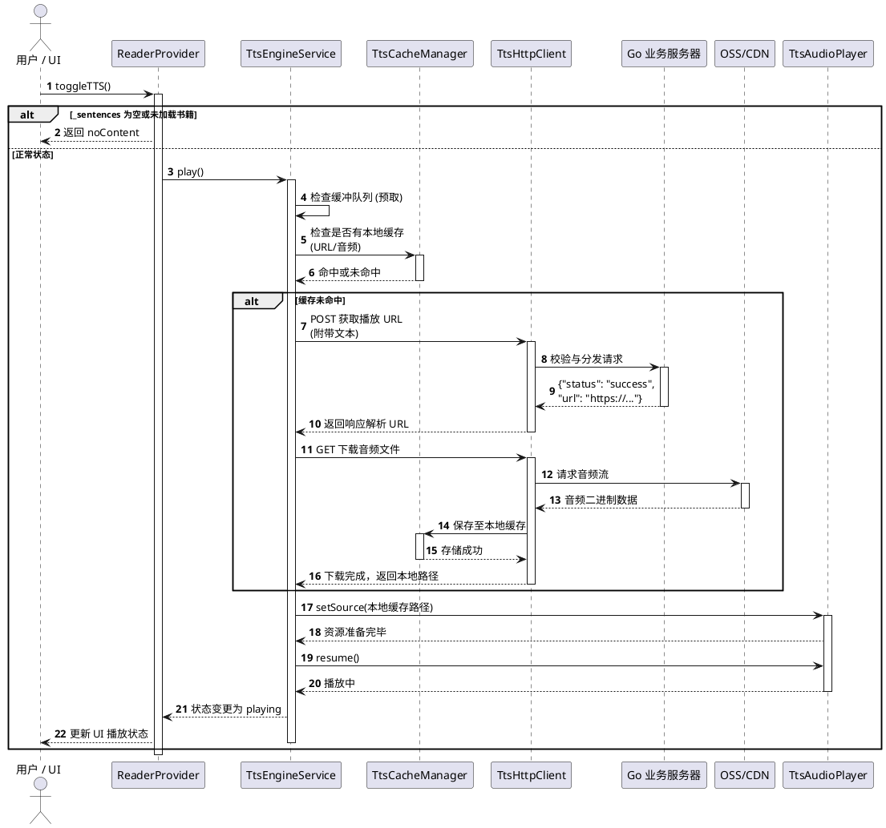
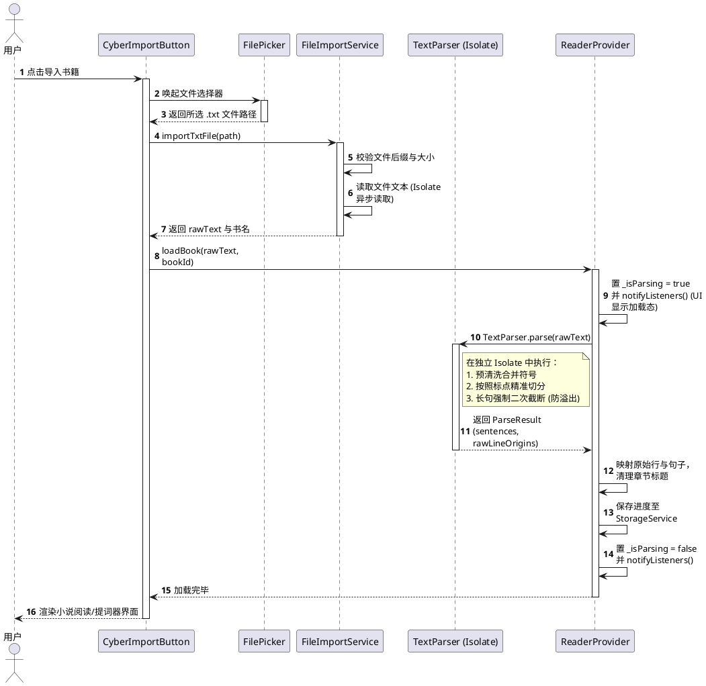
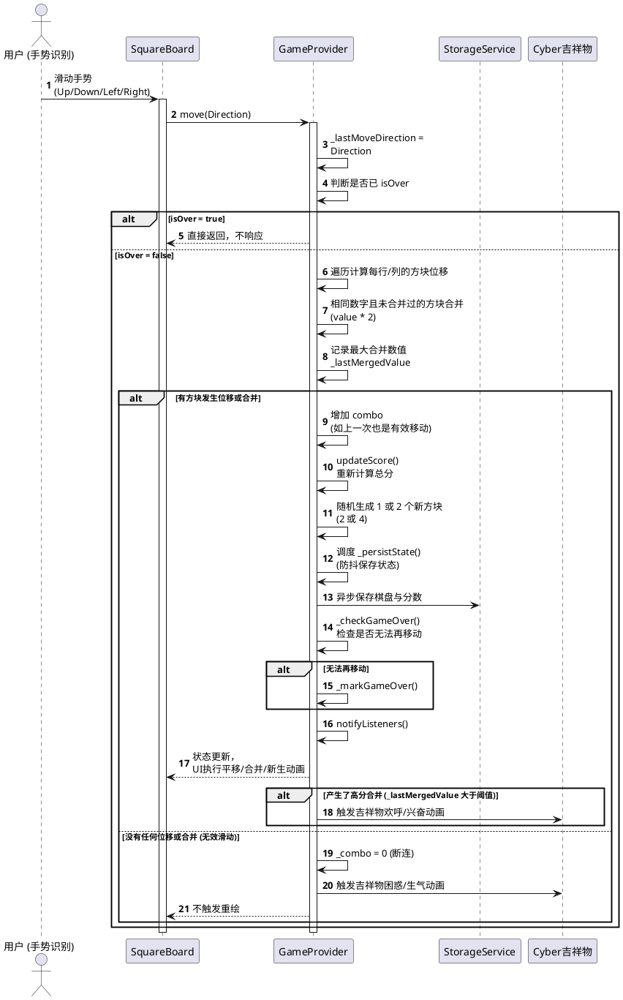

# 阅游 (YueYou) - 核心业务流程文档

本文档使用 PlantUML 时序图详细记录了阅游的核心业务流程，供 AI 与开发人员精确理解系统交互、数据流向及异常处理分支。

## 1. TTS 朗读核心流程

该流程涵盖了从触发朗读、检查缓存、向服务端请求下载到最终播放与状态同步的完整链路。

## 2. 书籍导入与解析流程

该流程涵盖从本地选择文本文件、读取、在独立 Isolate 中清洗和解析、再到挂载至 Provider 的完整链路。

## 3. 2048 游戏核心逻辑

该流程说明了用户的滑动操作如何触发矩阵变换、合并得分、驱动动画粒子并在必要时结合吉祥物反馈。

