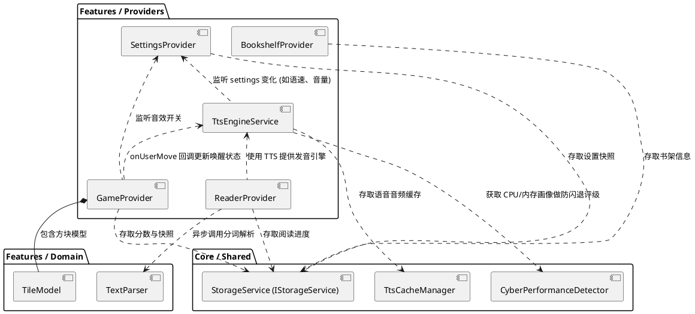

# 阅游 (YueYou) - 模块依赖关系文档

本文档详述了阅游项目中各个层级与功能模块之间的依赖边界、调用规范以及核心接口关联，以保障“Feature-Driven Clean Architecture”原则得以严格执行。

## 1. 全局架构分层

整个项目分为以下几个关键层次：

- **`core/`**：基础设施层。提供全局共享的工具（日志、网络、性能监控）、数据库访问（StorageService）、设计令牌（CyberColors 等）以及接口定义。
  - **依赖限制**：禁止依赖 `features/` 下的任何代码。
- **`shared/`**：共享业务组件层。包含各特性之间共用的 UI Widget（如 `TtsErrorListener`）。
  - **依赖限制**：可依赖 `core/`，避免跨功能特性互相依赖。
- **`features/`**：特性层。按照业务功能（如 audio, dashboard, game_2048, library, reader, settings）划分。每个特性内部严格按照 Clean Architecture 进行细分：
  - `domain/`：纯 Dart 逻辑（实体、模型、解析器），禁止引入 UI 或 Flutter 包。
  - `providers/`：状态管理（Provider 层），消费 domain 层，供 UI 层监听。
  - `presentation/`：UI 层，包含 widgets 和 screens。仅消费 Provider，不编写复杂业务逻辑。

## 2. 核心模块依赖关系图

以下关系图展示了系统核心模块之间在运行时（Provider层）和业务层级的依赖关系。

## 3. 核心接口与调用规范

### 3.1 IStorageService (核心存储契约)
- **位置**：`core/database/i_storage_service.dart`
- **职责**：抽象所有的本地持久化存取。
- **调用规范**：
  - 业务层（Provider）中禁止直接调用 `SharedPreferences`。必须统一通过 `StorageService`（IStorageService 的具体实现）访问。
  - 存取行为必须保持高内聚，读写逻辑全部封装在 Service 内部。

### 3.2 TtsEngineService (发声引擎)
- **位置**：`features/audio/services/tts_engine_service.dart`
- **职责**：封装所有底层 TTS 请求与音频播放逻辑。
- **参数与返回规范**：
  - 调用 `play()` / `pause()` 时应处理可能抛出的异常，但底层需通过 `lastError` 状态进行 UI 的统一广播。
  - `TtsAudioRequest` 结构必须严格包含 `lineIndex` 和 `text`。
- **异常处理**：遇到网络或权限问题时，向 `lastError` 写入常量（由 `CyberErrorMessages` 管理），由共享层的 `TtsErrorListener` 统一进行拦截与视觉弹窗提示。

### 3.3 TextParser (独立线程解析器)
- **位置**：`features/reader/domain/text_parser.dart`
- **职责**：百万字文本的纯文本解析与防溢出截断。
- **调用规范**：
  - **严禁** 在 UI 主线程直接调用 `_internalParse`。必须通过 `TextParser.parse()`（基于 `Isolate.run` 封装的异步方法）进行调用，以免卡死界面帧。

## 4. 边界与禁忌 (Anti-Patterns)

1. **跨 Feature 调用禁令**：如 `library/` 下的组件需要获取阅读进度，不应该直接引入 `reader/` 的文件，而是应该通过共同的顶层 Provider 进行消费，或通过明确的路由回调传递。
2. **Domain 层的纯净性**：`domain/` 目录下的所有 `.dart` 文件，其 `import` 列表中严禁出现 `package:flutter/material.dart` 或任何与 Widget 相关的引用。
3. **UI 层的单向数据流**：`presentation/` 中的 Widget 只能触发 Provider 的方法（如 `context.read<ReaderProvider>().nextSentence()`），严禁在 Widget 内部直接使用 `setState` 维护核心业务数据状态。
