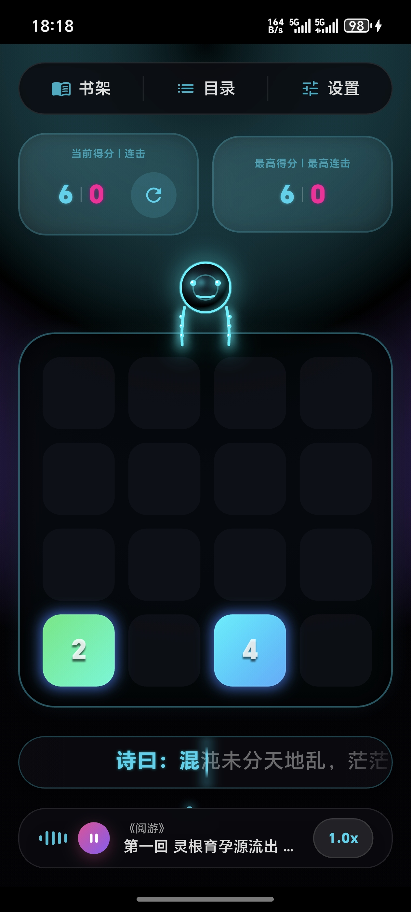
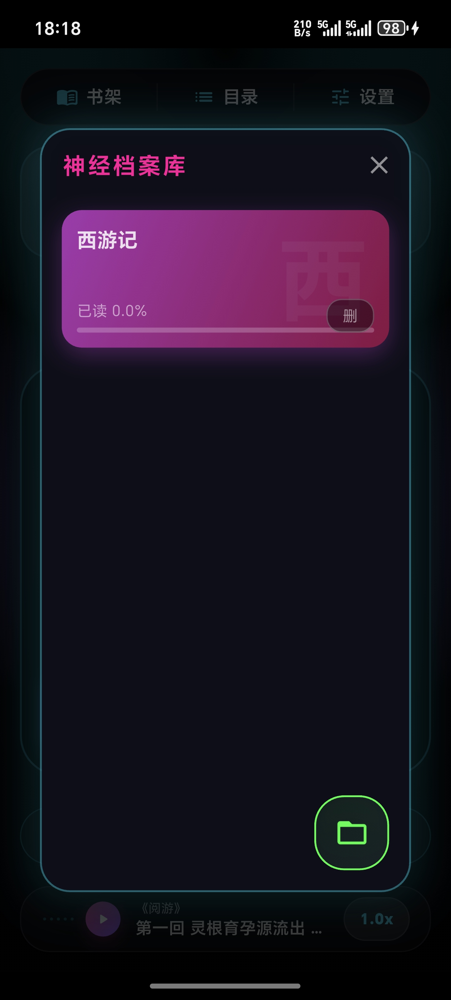
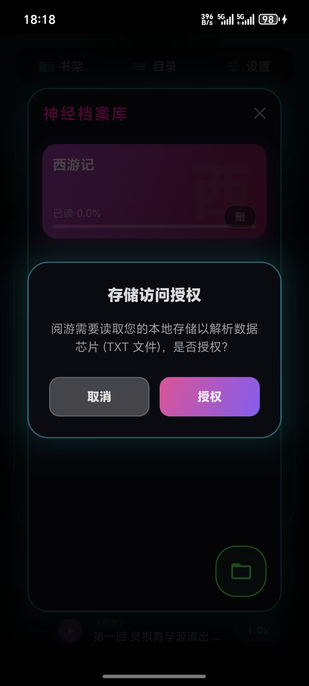
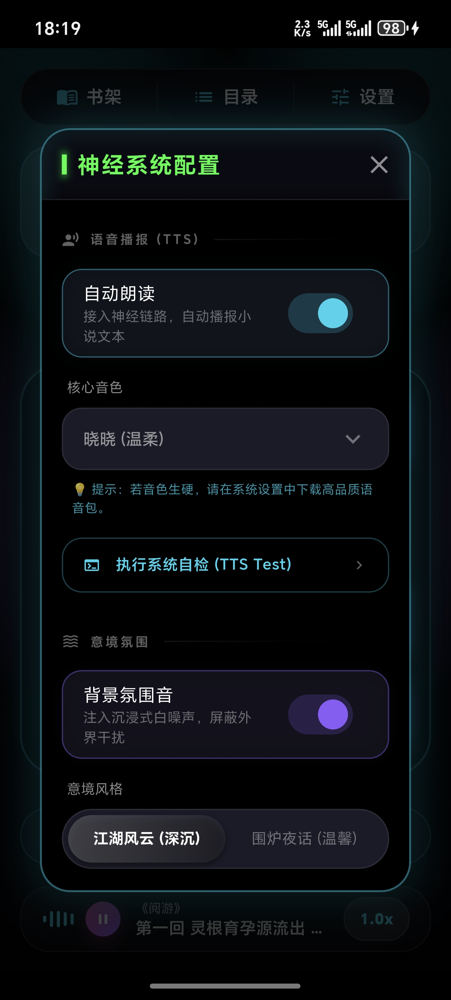
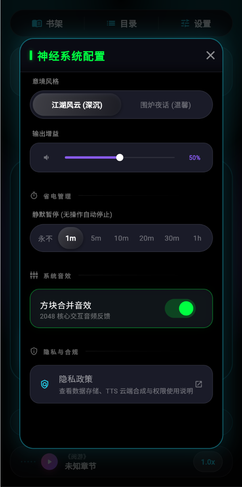

# 阅游 V1.1.0 操作说明书

## 1. 软件概述

阅游是一款融合沉浸式小说听读与 2048 益智游戏的移动应用，面向小说阅读、听书和轻量休闲娱乐场景。

- **软件名称**：阅游
- **版本号**：V1.1.0
- **运行环境**：Android 8.0 及以上
- **主要功能**：TXT 小说导入、章节阅读、TTS 朗读、阅读进度保存、2048 游戏、设置管理

## 2. 安装与启动

用户通过应用商店下载安装阅游，安装完成后点击桌面图标启动应用。

首次启动时，应用会展示隐私政策弹窗。用户可以查看应用如何处理本地文件、阅读进度和网络朗读数据。只有点击“同意”后，应用才会进入主界面；点击“不同意并退出”则退出应用。

## 3. 主界面说明

主界面采用赛博朋克视觉风格，包含阅读控制台、2048 游戏区域、状态提示和功能入口。

- 顶部展示应用状态与提示信息
- 中央区域可进行 2048 游戏操作
- 底部提供听读控制、书库入口和设置入口

## 4. 书库管理

点击书库入口后，用户可以查看已导入的本地小说，也可以通过“导入 TXT”按钮选择本机文件。

导入文件时，系统会打开 Android 文件选择器，用户选择 TXT 文件后，应用自动解析文本内容并加入书架。应用支持 UTF-8 与 GBK 编码识别，并对大文件使用后台线程处理。

## 5. 阅读功能

用户选择书籍后进入阅读界面。应用会自动保存当前章节、段落和滚动位置，方便下次继续阅读。

阅读界面支持：

- 章节切换
- 当前句高亮
- 滚动阅读
- 阅读进度恢复

## 6. 听读功能

阅游支持云端 TTS 朗读。用户点击播放后，应用会将当前句文本发送至业务服务器获取音频地址，再从 CDN 下载音频并播放。网络异常时，应用会自动降级为系统本地 TTS，保障连续朗读体验。

用户可以在设置中调整朗读速度、音色和环境音。

## 7. 章节列表

章节列表页面展示当前书籍的章节结构，用户可以快速跳转到指定章节。默认书籍支持在线章节目录和本地降级目录。

## 8. 2048 游戏

主界面内置 2048 游戏。用户通过上下左右滑动控制方块移动，相同数字方块碰撞后合并并获得分数。

游戏功能包括：

- 滑动合并
- 连击计分
- 游戏结束提示
- 重新开始
- 战绩展示

## 9. 设置功能

设置页面提供朗读参数、音效、环境音和显示效果相关配置。用户修改设置后，应用会保存到本地设备。

## 10. 隐私与数据说明

阅游重视用户隐私。应用不采集通讯录、短信、通话记录、定位等敏感个人信息；阅读进度、书架、设置和游戏存档均保存在本地设备。

文件导入通过 Android 系统文件选择器授权完成，应用只读取用户主动选择的文件。TTS 朗读仅处理当前需要朗读的文本内容，不上传完整书库和阅读进度。

## 11. 常见问题

### 11.1 为什么需要网络？

云端 TTS、默认书籍目录和章节下载需要网络连接。网络异常时，朗读会尝试降级为系统本地 TTS。

### 11.2 为什么导入文件时会打开系统页面？

Android 系统文件选择器是系统授权页面。用户选择文件即表示授权应用读取该文件。

### 11.3 我的阅读进度会上传吗？

不会。阅读进度、设置和游戏存档均保存在本地设备。

## 12. 退出应用

用户可以通过系统返回键或任务管理器退出应用。退出后再次打开，应用会自动恢复上次阅读进度和设置。

