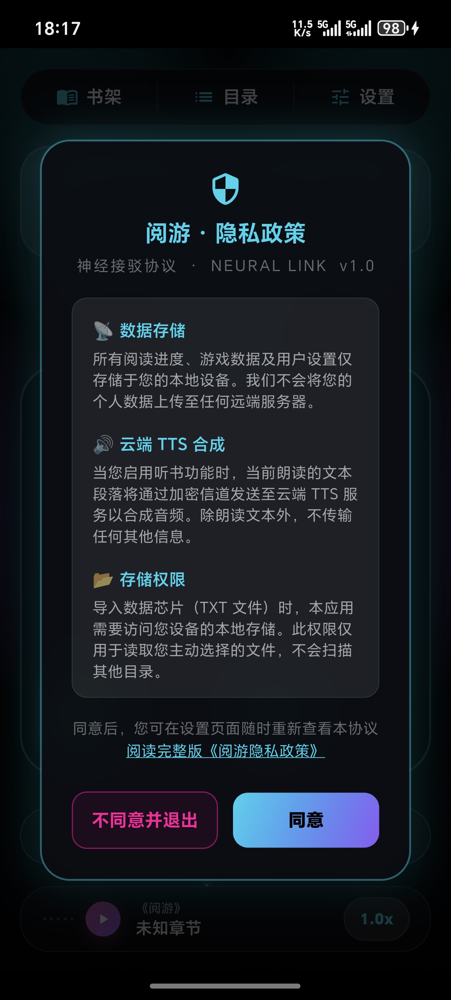
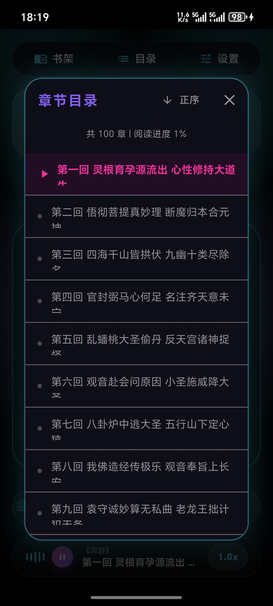

# 阅游V1.1.0 设计与使用说明书

## 一、文档目的

本文件作为阅游V1.1.0软件著作权登记的《设计与使用说明书》，用于描述软件的内容、组成、设计、功能规格、开发情况、测试结果及使用方法。

本文档作为文档鉴别材料，与源代码鉴别材料配套提交，重点说明软件的原创设计思路、模块构成、业务流程、运行方式和用户使用方法。

本文档不追求机械凑页，而是以完整、真实、可核验为原则，对阅游V1.1.0的主要实现内容进行自然说明。若最终页数不足60页，则按软件著作权登记规则提交整份文档。

## 二、软件概述

### 2.1 软件名称与版本

- 软件名称：阅游V1.1.0
- 版本号：V1.1.0
- 申请人：胡传龙
- 开发方式：独立开发
- 权利取得方式：原始取得

### 2.2 软件定位

阅游V1.1.0是一款面向Android平台的沉浸式小说听读与2048益智游戏融合应用。

软件以本地TXT小说阅读为核心，提供章节阅读、云端TTS听读、阅读进度保存、环境音辅助、2048游戏互动和设置管理等功能。

软件目标是为用户提供一个兼顾阅读、听读、轻娱乐和隐私合规的移动应用，强调以下原则：

- 本地优先保存用户数据
- 界面交互清晰稳定
- 听读能力与阅读状态联动
- 关键配置和隐私信息可公开查看

### 2.3 运行环境

| 项目 | 说明 |
| --- | --- |
| 运行平台 | Android 8.0及以上 |
| 客户端框架 | Flutter 3.x |
| 客户端语言 | Dart 3.x |
| 状态管理 | flutter_riverpod |
| 本地存储 | SharedPreferences、path_provider |
| 音频相关 | audioplayers |
| 服务端语言 | Go 1.21+ |
| 服务端框架 | Gin |
| 资源存储 | OSS/CDN |

## 三、软件组成

阅游V1.1.0由移动客户端、业务服务端、资源层和本地存储层组成。

### 3.1 移动客户端

移动客户端负责软件启动与初始化、本地TXT导入、书架管理、章节阅读、阅读进度维护、TTS请求发起、音频播放、环境音控制、2048游戏交互以及设置管理。

客户端主要代码位于 `lib/` 目录，并按照功能模块拆分为 `reader`、`audio`、`library`、`game`、`settings` 等特性目录。

### 3.2 业务服务端

业务服务端负责接收TTS朗读请求、返回音频下载地址、提供默认书籍章节目录、返回章节访问地址，并输出公开可访问的隐私政策HTML页面。

服务端代码位于 `server/` 目录，使用Go语言和Gin框架实现。

### 3.3 资源层与本地存储层

资源层主要存放默认书籍资源、TTS音频文件和部分静态页面资源。客户端不直接依赖底层存储实现，而是通过服务端业务接口获取资源访问地址。

本地存储层用于保存隐私协议同意状态、阅读进度、书架信息、朗读相关设置、环境音设置、游戏状态以及TTS缓存文件。

## 四、总体设计思路

### 4.1 架构设计原则

软件采用 Feature-Driven Clean Architecture 组织方式，强调分层边界清晰、业务逻辑可测试、状态变更集中管理。

整体结构分为以下几层：

- `core/`：全局配置、主题、常量、日志和基础能力
- `features/*/domain/`：纯业务规则和计算逻辑
- `features/*/providers/`：状态管理、异步流程和业务编排
- `features/*/presentation/`：界面渲染和交互转发
- `shared/`：通用组件和共享界面元素

### 4.2 总体模块关系图

```text
┌───────────────────────┐
│      Flutter 客户端    │
├─────────┬─────────────┤
│ 阅读模块 │ 听读/音频模块 │
├─────────┼─────────────┤
│ 书库模块 │ 设置/游戏模块 │
└────┬────┴──────┬──────┘
     │           │
     │           └── 本地存储（进度/设置/缓存）
     │
     └── Go 服务端（TTS/目录/章节/隐私页）
                 │
                 └── OSS/CDN 资源层
```

### 4.3 设计目标

软件在设计时重点关注以下目标：

1. 业务逻辑不直接耦合界面层，便于维护与测试。
2. 用户阅读数据本地保存，不向服务端同步个人阅读记录。
3. 云端TTS流程遵循“先取地址、再下载音频”的分离下载契约。
4. 设置页和隐私页信息保持可公开访问和可重复查看。
5. 高频交互区域尽量减少不必要重绘，保证体验流畅。

## 五、客户端功能设计

### 5.1 启动与初始化模块

客户端启动入口位于 `main.dart`。软件启动时主要执行以下工作：

1. 初始化应用基础环境。
2. 初始化本地存储和日志系统。
3. 检查隐私政策同意状态。
4. 如未同意，则弹出隐私协议弹窗。
5. 完成基础初始化后进入主界面。

该流程要求在未获得用户隐私授权前，不进入主功能使用状态。

```text
[应用启动]
    ↓
[初始化基础能力]
    ↓
[检查隐私同意状态]
    ├─ 已同意 → [进入主界面]
    └─ 未同意 → [展示隐私弹窗]
                 ├─ 同意 → [保存状态并进入主界面]
                 └─ 拒绝 → [退出应用]
```


图1展示应用的启动页或首次进入页面，用于说明软件启动后的视觉入口形态。



图2展示首次启动时的隐私政策弹窗，说明软件在功能使用前要求用户进行隐私确认。

### 5.2 主界面模块

主界面承载状态提示、阅读相关入口、章节入口、设置入口和2048游戏区域，是软件的核心调度界面。

主界面风格为赛博朋克视觉主题，突出功能分区和核心操作路径。


图3展示主界面布局以及2048游戏区域，说明阅读与轻娱乐能力的融合方式。

### 5.3 书库模块

书库模块用于管理用户导入的本地小说与默认书籍入口。

主要能力如下：

- 导入TXT文件
- 显示书架列表
- 展示书籍标题与入口
- 进入阅读页面
- 保留最近访问状态

用户导入TXT时，系统通过Android系统文件选择器获取用户主动授权的文件。

```text
[进入书库]
    ↓
[点击导入TXT]
    ↓
[打开系统文件选择器]
    ↓
[用户选择文件]
    ↓
[解析文本并加入书架]
    ↓
[进入阅读或返回书架]
```


图4展示书库页面，用于说明本地书籍管理能力。


图5展示Android系统文件选择器或TXT导入流程，用于说明文件授权读取方式。

### 5.4 文本解析模块

文本解析模块用于将TXT内容转换为可阅读、可朗读的结构化文本数据。

主要职责如下：

- 识别章节标题
- 划分段落
- 切分句子
- 保持原始文本顺序
- 尽量避免丢失有效字符

对于较大文件，系统尽量通过后台处理方式降低对主线程的阻塞影响。

### 5.5 阅读模块

阅读模块负责展示章节内容和维护阅读状态。

主要功能如下：

- 显示当前章节文本
- 记录并恢复阅读进度
- 当前句高亮
- 与TTS播放状态联动
- 支持滚动阅读

阅读进度保存在本地设备，应用重启后可自动恢复到上次阅读位置。


图6展示阅读页面，用于说明章节内容展示、句子阅读和界面信息组织方式。

### 5.6 听读模块

听读模块负责云端TTS请求、音频下载、缓存和播放控制。

主要功能如下：

- 获取当前待朗读句子
- 向服务端发送TTS请求
- 解析返回的音频地址
- 下载并缓存音频文件
- 播放、暂停、停止朗读
- 网络失败时尝试本地降级

```text
[用户点击播放]
    ↓
[获取当前句文本]
    ↓
[POST 到 Go 服务端]
    ↓
[返回 JSON: status + url]
    ↓
[GET 下载音频文件]
    ↓
[写入本地缓存并播放]
```


图7展示听读状态或播放控制区域，用于说明朗读功能的实际使用界面。

### 5.7 章节列表模块

章节列表模块用于快速跳转章节，减少长篇小说阅读中的导航成本。

用户可以从当前书籍直接查看章节结构并跳转到目标章节。



图8展示章节列表界面，用于说明章节导航能力。

### 5.8 环境音与2048游戏模块

环境音模块用于为阅读和听读提供背景氛围，用户可在设置页面开启或关闭环境音，并可调整风格和音量。

2048模块负责棋盘状态、移动规则、合并计算、计分和结束判断。

主要能力如下：

- 上下左右滑动
- 相同数字合并
- 计分更新
- 结束判断
- 重新开始

游戏逻辑尽量保持纯计算方式，便于测试与后续维护。


图9展示2048游戏界面，用于说明休闲游戏功能在主界面中的呈现方式。

### 5.9 设置模块

设置模块负责管理应用运行参数和用户偏好。

设置项包括：

- 自动朗读开关
- 核心音色选择
- 背景氛围音开关
- 氛围风格选择
- 输出增益调整
- 静默暂停时间
- 系统音效开关
- 隐私政策入口

设置页中的展示文案统一收敛在 `SettingsTexts` 中，避免在界面文件中散落硬编码内容。


图10展示设置页面，用于说明朗读、音效、环境音和系统配置的集中管理方式。


图11展示设置页中的隐私政策入口，用于说明用户可以在首次授权之后再次查看隐私政策。

## 六、服务端设计

### 6.1 服务端入口

服务端入口位于 `server/main.go`，负责注册路由、设置Gin运行模式并启动HTTP服务。

### 6.2 TTS接口设计

客户端调用TTS能力时，先向业务服务端发送POST请求。

服务端返回JSON结果，格式约定如下：

```json
{"status":"success","url":"https://example.com/audio.mp3"}
```

客户端解析 `url` 后，再通过GET请求下载音频文件。该流程确保客户端遵守“分离下载”原则。

### 6.3 书籍目录接口设计

服务端提供默认书籍目录接口，用于返回指定书籍的章节目录数据。当前默认书籍为《西游记》。

### 6.4 章节地址接口设计

服务端根据书籍编号和章节编号返回章节公网访问地址，客户端随后再下载章节文本内容。

### 6.5 隐私政策页面设计

服务端提供 `/privacy` 页面，用于公开展示隐私政策，供用户查看和应用商店审核访问。

## 七、数据存储与隐私设计

### 7.1 本地设置数据

以下设置数据保存在本地设备：

- 隐私协议同意状态
- 自动朗读开关
- 音色选择
- 环境音开关
- 环境音风格
- 环境音音量
- 静默暂停时间
- 系统音效开关

### 7.2 阅读相关数据

以下阅读数据保存在本地设备：

- 书架信息
- 阅读进度
- 当前章节位置
- 最近访问记录

### 7.3 缓存数据

以下缓存数据保存在本地文件系统：

- TTS音频缓存
- 默认书籍资源缓存
- 其他运行期缓存文件

缓存用于减少重复请求、提升响应速度并改善离线体验。

### 7.4 隐私保护设计

软件不采集通讯录、短信、通话记录、定位、相机和麦克风等敏感个人信息。

阅读进度、书架、设置和游戏存档均保存在用户本地设备，不向服务端同步。

导入TXT文件时，软件通过Android系统文件选择器读取用户主动选择的文件，不扫描其他目录。

## 八、功能规格说明

### 8.1 隐私协议功能

- 首次启动必须展示隐私弹窗。
- 用户不同意则退出应用。
- 用户同意后写入本地状态。
- 设置页面提供隐私政策入口。

### 8.2 书库功能

- 支持导入TXT文本。
- 支持书架列表展示。
- 支持点击书籍进入阅读。
- 书架数据保存在本地设备。

### 8.3 阅读功能

- 支持章节阅读。
- 支持句子高亮。
- 支持滚动阅读。
- 支持阅读进度恢复。

### 8.4 听读功能

- 支持云端TTS。
- 支持音频缓存。
- 支持播放、暂停、停止。
- 支持本地降级。

### 8.5 游戏功能

- 支持滑动。
- 支持合并。
- 支持计分。
- 支持重新开始。

### 8.6 设置功能

- 支持朗读参数调整。
- 支持环境音开关和风格切换。
- 支持静默暂停配置。
- 支持系统音效开关。
- 支持隐私政策入口。

## 九、测试说明

### 9.1 静态分析

客户端使用 `flutter analyze` 进行静态分析，要求零错误零警告。

### 9.2 自动化测试

项目包含文本解析测试、TTS契约测试、音频状态测试等自动化测试。

测试重点包括：

- 解析结果不丢失有效字符
- 原始顺序保持一致
- 连续标点不产生空句
- TTS遵循先POST获取URL再GET下载的契约
- 暂停后不会误推进下一句

### 9.3 服务端验证

服务端通过 `go test ./...` 验证代码可编译与基础逻辑可通过测试。

### 9.4 文档与脚本验证

软著相关PDF生成脚本通过Python语法检查，确保脚本本身可执行。

文档PDF若不足60页，则提交整份；若超过60页，则提交连续前30页和后30页。

## 十、用户使用方法

### 10.1 启动软件

用户安装完成后点击应用图标启动软件。首次运行时阅读隐私政策并选择是否同意。

### 10.2 导入书籍

进入书库页面后点击导入TXT按钮，在系统文件选择器中选择本地小说文件。

### 10.3 开始阅读

在书架中选择目标书籍即可进入阅读页面，系统会自动恢复最近阅读进度。

### 10.4 开始听读

在阅读页面点击播放按钮即可启用听读功能，系统按句朗读文本并同步高亮当前句子。

### 10.5 使用2048功能

用户可在主界面通过滑动操作进行2048游戏，系统自动更新分数和游戏状态。

### 10.6 调整设置

用户可进入设置页面调整自动朗读、音色、环境音、静默暂停和系统音效，也可重新打开隐私政策页面。

## 十一、开发情况说明

阅游V1.1.0由胡传龙独立开发完成。

开发过程中重点完成了以下工作：

1. 构建本地TXT导入与阅读能力。
2. 构建云端TTS链路与缓存能力。
3. 完成2048游戏与阅读主界面融合。
4. 完成隐私合规弹窗与公开隐私政策页面。
5. 完成设置页、日志规范化与相关测试建设。

## 十二、结论

阅游V1.1.0具备明确的软件组成、较完整的结构设计、可验证的功能规格、清晰的用户使用路径和相应的测试依据。

本文档能够较完整地描述软件的内容、组成、设计、功能规格、开发情况、测试结果及使用方法，可作为软件著作权登记的文档鉴别材料提交。
